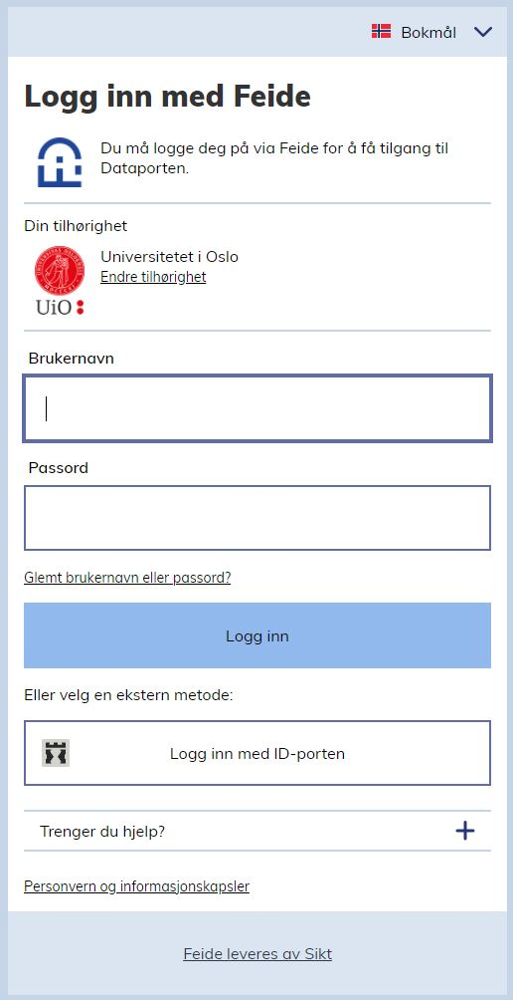
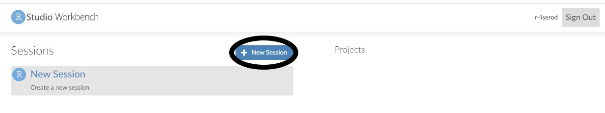
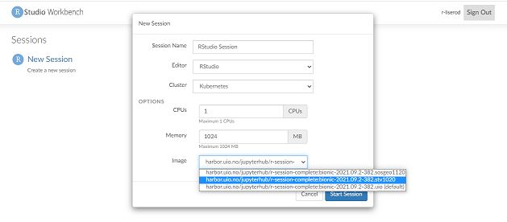
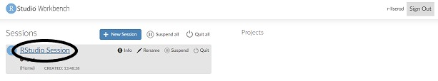
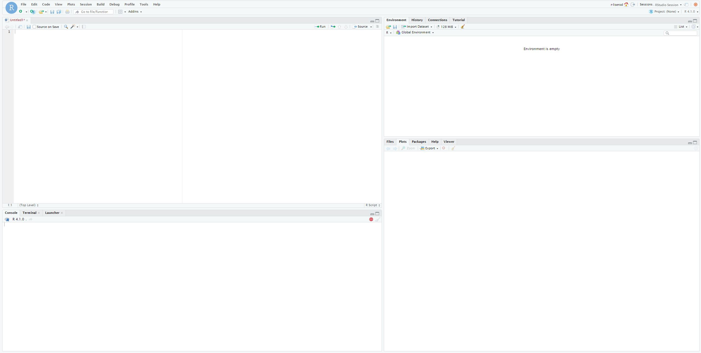
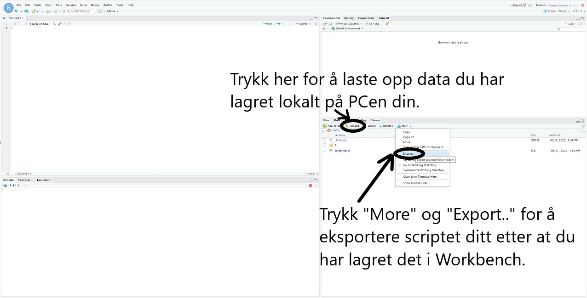

## Guide for å åpne RStudio Workbench

1. Åpne nettleseren din og gå til https://rstudio-workbench.uio.no/ 
2. Velg Universitetet i Oslo/University of Oslo under tilknytning/affiliation.

3. Logg inn med brukernavn og passord fra UiO. 

 
4. Trykk på "+ New Session".

5. Velg STV1020-varianten under "Image" og trykk "Start session". Du kan også velge å gi sesjonen et eget navn under "Session Name".

6. Den nye sesjonen skal nå dukke opp under "Session". Trykk på "RStudio Session". Dersom du har gitt sesjonen et eget navn så må du trykke på den sesjonen med navnet du brukte.  

7. Nå skal du få opp Rstudio i nettleseren din.

### Hvordan navigere RStudio Workbench?

