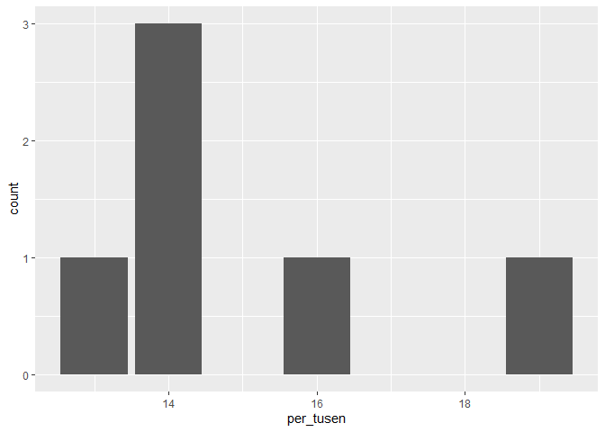

Seminar 1
================
Lise Rødland
March 3, 2021

# Velkommen til første seminar!

Gjennom 6 seminarganger skal vi nå gå igjennom alt fra hva R og Rstudio
er og hvordan det fungerer, til å kjøre våre helt egne
regresjonsanalyser. Jeg gleder meg!

Før hvert seminar kommer jeg til å legge ut lenke til fire ting på
Canvas:

-   R-script
-   En fil som forklarer litt mer av scriptet
-   Oppgavesett
-   Datasett

Det dokumentet du leser nå er det som forklarer litt mer av scriptet.
Dette dokumentet legger jeg ut som .pdf-, .md- og .Rmd-fil. Jeg vil
anbefale dere å bruke .md-filen fordi det er ikke alltid hele kodelinjen
kommer med i .pdf-filene. Om noen av dere har least kapittel 2 i Healy
så vil dere kanskje huske at han omtaler RMarkdown-dokumenter. Dette
dokumentet er skrevet ved hjelp av RMarkdown i R. Dersom dere vil kikke
nærmere på koden så kan dere kikke på .Rmd-filen.

I disse dokumentene vil dere finne noe tekst, noen figurer og tabeller,
og noe kode. Innholdet reflekterer det jeg har planlagt at vi skal gå
gjennom på seminaret. Koden vil ha en egen grå bakgrunn som her:

``` r
# Dette er kode.  
```

Alt som er skrevet i grått kan dere kopiere inn i et R-script og kjøre
for å se hva som skjer. Når jeg har \# foran en tekstlinje så betyr det
at jeg skriver en kommentar i scriptet mitt. Når vi setter en \# foran
teksten så skjønner R at dette ikke er vanlig kode, men en kommentar.
Resultatene av faktisk kode vil komme i et eget felt med grå bakgrunn
under. R sin respons kjennetegnes ved at linjene starter med \#\#. Se
for eksempel her:

``` r
# Dette er en kommentar. 
# Nå skal vi gjøre et lite forsøk med noe enkel matte! 
# For å kjøre koden setter dere musepekeren ved siden av, og trykker ctrl+enter (cmd+return på Mac). 
100/2+4
```

    ## [1] 54

# Mapper, filbaner og prosjekter

Før vi begynner med R så skal vi se litt nærmere på mapper, filbaner og
prosjekter. Når vi skal jobbe med R er det viktig at du er klar over hva
mapper og filbaner er. Vi kommer til å lagre script, figurer og datasett
i mapper som vi vil finne igjen senere. I tillegg trenger vi filbanene
for å fortelle R hvor datasettet vi ønsker å laste inn befinner seg.

For å åpne mapper bruker vi Filutforsker (Windows) og Finder (Mac). Ofte
ligger mapper inne i andre mapper, under en harddisk (for eksempel C:).
Mappene vi må klikke oss gjennom for å komme fra harddisken til en
bestemt mappe eller fil, f.eks. mappen STV1020, utgjør filbanen til
mappen STV1020. I Filutforsker finner du filbanen øverst. Du kan merke
den ved å klikke på den og så høyreklikke for å kopiere den. På Mac kan
du i følge [Apple sine support
sider](https://support.apple.com/no-no/guide/mac-help/mchlp1774/11.0/mac/11.0)
klikke på Finder-symbolet i Dock for å åpne et Finder-vindu og velge Vis
&gt; Vis banelinje for å finne filbanen. Plasseringen og nestede mapper
som inneholder filen din eller mapper skal så vises mot bunnen av
Finder-vinduet. I seminar kommer jeg til å vise dette i Windows, men jeg
har aldri gjort dette med Mac så det krever litt egeninnsats fra dere
med Mac. Om du har problemer så spør gjerne i seminar så hører vi om
noen andre med Mac kan vise.

De av dere som har lest Healy sitt pensumbidrag husker kanskje at han
anbefaler å jobbe i prosjekter. Prosjekter er en fin måte å organisere
notatene fra R-seminarene på. I første seminar kommer jeg til å vise
hvordan dere kan opprette et prosjekt for R-seminarene. Når en oppretter
et prosjekt så kan en velge om en vil knytte det opp til en eksisterende
mappe eller opprette en ny mappe. Jeg kommer til å vise hvordan dere kan
opprette en ny mappe. Jeg vil anbefale at dere lagrer alle datasett og
script i denne mappen. Lag dere gjerne et eget system med undermapper
for hver seminargang eller en mappe til datasett, en til script osv.

Når du oppretter et prosjekt så vil det legge seg en fil med suffiks
.Rproj i mappen din. Det er denne du skal åpne hver gang du vil jobbe
videre med seminarfilene. Da husker R hvilke mapper innholdet ditt
ligger i. Om dere vil så kan dere lese mer om prosjekter i Appendix i
Healy eller i [R for Data
Science](https://r4ds.had.co.nz/workflow-projects.html). Et alternativ
til å jobbe i prosjekt er å bruke `setwd("filbane")` hver gang du åpner
et script.

# R og RStudio

Før seminaret har dere lastet ned R og RStudio. R er selve
programeringsspråket vi bruker og som gjør at vi kan skrive kode. Når vi
laster ned R så laster vi egentlig ned et program som gjør at
datamaskinen vår kan forstå det vi skriver, og gjøre det vi ønsker at
den gjør. Selve R-scriptet, eller koden om en vil, kunne vi egentlig
skrevet i word, eller notisblokk. RStudio, programmet vi kommer til å
bruke, er det som kalles et “Integrated development environment” (IDE),
og brukes for å gjøre det lettere å skrive scriptet.

Rstudio har flere fordeler. Vi har for eksempel enkel tilgang til
hjelpefiler, den markerer hva forskjellig kode er ved hjelp av farger,
og presenterer resultatene på en (vanligvis) lettleselig måte. Derfor er
det alltid Rstudio vi åpner når vi skal jobbe med R. Hvordan Rstudio ser
ut er beskrevet i Healy og i [denne introduksjonen til R og
Rstudio](https://github.com/liserodland/stv4020aR/blob/master/H20-seminarer/Innf%C3%B8ringsseminarer/docs/installasjonsguide_R.md).
Vi kommer også til å gå gjennom de ulike panelene i seminaret.

## Hjelpefiler

Ofte når vi bruker R er vi usikre på hvordan forskjellige funksjoner
fungerer. Da kan det være nyttig å lese hjelpefilene som forteller hva
en funksjon gjør, og hvordan en skal bruke den. For å gjøre dette
skriver du et spørsmålstegn før navnet på funksjonen.

``` r
#La oss prøve dette med "mean()" funksjonen, som logisk nok finner gjennomsnitt:
?mean
```

Dersom du får et svar som under her så tyder det på at du ikke har
installert pakken funksjonen ligger i. Da kan du legge til et
spørsmålstegn til og kjøre kode `??vif`.

``` r
?vif
```

    ## No documentation for 'vif' in specified packages and libraries:
    ## you could try '??vif'

I hjelpefilen får vi en del informasjon om funksjonen. Funksjoner
hjelper oss å hente ut *informasjon* fra data. Et eksempel på data kan
være en tallrekke fra 1 til 10. Informasjonen vi ønsker å hente ut kan
for eksempel være gjennomsnittet eller standardavviket. Vi kan bruke
funksjoner til å få R til å hente ut denne informasjonen for oss. Alle
funksjoner har til felles at de tar noe data, f.eks. tall, og skaper et
resultat. I tilegg har noen argumenter som gjør at vi kan endre på
hvordan funksjonen lager resultatet, hva vi får opp i consol og
liknende.

Leser vi hjelpefilen til funksjonen `mean()` så ser vi at den øverst gir
en beskrivelse, hvor det står at den returnerer gjennomsnittet. Under
der kommer argumentene den godtar; et argument (x) som definerer hvilke
data vi vil hente ut informasjonen fra, et argument for å trimme
dataene, altså fjerne noe, og na.rm argumentet som forteller R hvordan
de skal håndtere missingverdier i beregningen. Under Value får vi en
beskrivelse av hva funksjonen “produserer”, før til slutt et eksempel av
hvordan den brukes i bunn.

Hjelpefilene er en flott måte å finne ut hva en funksjon gjør, og
hvordan vi kan bruke den. Samtidig kan den ofte være litt kronglete å
lese. Da hjelper det ofte å se på eksemplene som alltid er i bunn av
teksten. Ellers beskriver også Healy hvordan man kan lese hjelpefilene i
Appendix. Skulle det fortsatt være vanskelig er det viktig å huske at
det finnes et stort miljø rundt R, og ofte er det mange som har opplevd
samme problem som deg! Litt googling, og et søk på
<https://stackoverflow.com/> vil fort gi gode svar! Det er også mulig å
spørre i [facebookgruppen R for statsvitenskap ved
UiO](https://www.facebook.com/groups/427792970608618).

## Syntax-feil

Når vi skriver kode vil vi fort gjøre en del feil. Det er helt vanlig og
noe som er helt uungåelig! Dere vil nok fort merke at jeg gjør en hel
del feil når jeg skal vise dere i seminaret. En type feil kan likevel
være grei å merke seg med en gang - mest fordi jeg gjør den hver gang
jeg skal skrive noe kode. “Syntax-feil” er skrivefeil vi gjør når vi
skriver kode. F.eks. kan det være å skrive men() istedenfor mean(),
glemme å lukke en parantes sånn at vi skriver mean( og liknende. Noe av
det fine med RStudio er at den markere sånne feil for oss!


Bildet over viser eksempler på feilskrevet kode samt hvordan Rstudio
markerer dette og hvilke feilmeldinger vi får når vi prøver å kjøre
koden. Dere kan se at R har markert tre av fire linjenummer med en rød
X. Dette er steder hvor RStudio mener jeg har gjort feil. Hvis jeg
holder musepekeren over kryssene får jeg opp forslag til hva som kan
være feilen. “Unexpected token ‘)’” betyr at RStudio mener det er en
parantes der som ikke skulle vært der. I tilegg er det røde streker
under de delene av koden som RStudio mener er feil. Jeg vil hevde, i
hvertfall etter min egen erfaring, at 90 % av feilene vi gjør i R er
enkle skrivefeil/syntax-feil som dette. Derfor er det veldig nyttig at
RStudio viser det på denne måten!

# Objekter, funksjoner, og klasser

Vi har allerede sett på litt enkel kode, men framover skal vi gått litt
dypere inn i hvordan kode faktisk fungerer. Koding er en måte å fortelle
pc-en hva vi vil den skal gjøre gjennom tekst. Sånn sett er det nærmest
det samme som når du klikker på noe, bare at koding er mer effektivt
(etter hvert som en lærer seg det). Når vi skriver kode må vi vite hva
vi skal skrive for at pc-en skal forstå det. All den tid det ikke finnes
noen enorm ordbok som forteller alt vi kan skrive i R er dette noe vi må
lære oss, og kanskje pugge, eller bare søke etter når vi trenger det.
Den vanligste måten å lære nye koder på er å google etter spesifikke
ting du ønsker å gjøre.

Det første vi skal se på er objekter. Objekter er i alle “ting” i R som
kan inneholde noe annet. Noen objekter laster vi inn ved hjelp av
pakker, noen er bygd inn i R og andre kommer vi til å lage selv. Dere
kan tenke på for eksempel datasett, funksjoner og modellresultater som
mulige objekter. Vi lager nye objekter ved å bruke R sin assignment
operator `<-`.

Vi skal i hovedsak forholde oss til to typer objekter; vektorer og
funksjoner. Hva disse er nok lettere å vise ved eksempel. La oss lage et
objekt med informasjon om et tall. For å gjøre dette må vi først velge
et objektnavn, så bruke `<-` (dette heter en “assignment operator”), og
så skrive hva objektet skal inneholde. Her lager jeg en vektor som heter
“To” og som inneholder tallet 2.

``` r
To <- 2

2 + To
```

    ## [1] 4

Som dere ser kan jeg nå skrive `2 + To`, kjøre koden og få ut resultatet
fire. Når vi nå skriver “To” vet R at vi *egentlig* mener tallet 2 som
er lagret i objektet. For så enkle ting som dette så er det nok enklere
å bare skrive 2, eller bruke en kalkulator for den saks skyld. Det fine
med objekter er at de kan inneholde veldig mye informasjon!

I første omgang kan vi prøve å lagre flere tall i et objekt. Det er
flere måter vi kan gjøre dette på, for eksempel så kan vi skrive 1:10
for å få alle heltallene mellom 1 og 10, eller skrive c(1, 22, 5, 2, 1)
for å lage en tallrekke. I det siste skiller jeg tallene med komma.
Objektene kan du kalle akkurat hva du vil, men som vi skal se på senere
er det noen retningslinjer som er lure å følge:

-   Navn bør bare inneholde små bokstaver, tall og \_.

-   Ikke bruk et tall som første tegn.

-   Ikke bruk æ/ø/å.

-   Ikke bruk mellomrom.

-   Ikke bruk FALSE, TRUE, Inf, for, else, break, function eller andre
    funksjonsnavn

La oss nå lage noen flere objekter:

``` r
en_til_hundre <- 1:100
tall <- c(1,4,56,8,4,2,4)

tall
```

    ## [1]  1  4 56  8  4  2  4

Nå som vi har et script med flere elementer kan vi prøve å kjøre noen
funksjoner på dem. Det kan nevnes at funksjoner faktisk er objekter de
og, men det blir først interessant når du holder på med litt mer
avansert kode. La oss se om vi kan finne gjennomsnittet av disse
vektorene:

``` r
mean(en_til_hundre)
```

    ## [1] 50.5

``` r
mean(tall)
```

    ## [1] 11.28571

Med funksjonen `mean()` får vi gjennomsnittet for hele
vektoren/objektet. Som oftest er det det vi ønsker, men om vi kun ønsket
gjennomsnittet av noen utvalgte tall så er det også mulig ved hjelp av
indeksering eller filtrering. Dette skal vi se mer på senere.

Om dere ser i environment så vil dere merke at etter navnet på vektoren
`tall` så står det først “num” og deretter \[1:7\]. Den første teksten
sier at dette er et numerisk objekt. Klasser skal vi straks gå inn på.
Det neste viser lengden på vektoren vår. `tall` har sitt første tall i
plassen 1, og siste i 7. Altså er det 7 elementer. Om vi ser på
`en_til_hundre` ser vi at det står 1:100, og denne har altså 100
elementer.

For å få tak i et spesifikt element kan vi bruke disse klammeparanteser.
La oss si at vi vil ha element nr. 5 i vektoren tall:

``` r
tall[5]
```

    ## [1] 4

Når vi kjører denne ser vi at vi får ut det femte tallet i tallrekka vi
skreiv inn i stad. Dette kan vi også sjekke i environment for å se at
stemmer.

På samme måte som vi definerte en rekke tall istad, kan vi også hente ut
en rekke elementer.

``` r
tall[3:6]
```

    ## [1] 56  8  4  2

``` r
tall[c(3,5,3,6)]
```

    ## [1] 56  4 56  2

Vi kan også finne gjennomsnittet av utvalgte tall:

``` r
mean(tall[c(3,5,3,6)])
```

    ## [1] 29.5

Eller bruke disse som et nytt objekt:

``` r
Ny_Vektor <- tall[c(3,5,3,6)]
```

## Klasser

Så langt har vi kun jobbet med tallverdier. Ofte har vi variabler som
ikke er tall, men f.eks. tekst eller ordinalverdier. I R vil vi også se
at visse funksjoner krever at dataene er i visse klasser. Hovedklassene
vi kommer til å bruke er; numeric, character, logical og factor. Numeric
er tall (logisk nok). De fleste mattefunksjoner krever at dataene er
numeric. For å sjekke om noe er numeric kan vi bruke funksjonen
`is.numeric()`.

``` r
is.numeric(en_til_hundre)
```

    ## [1] TRUE

``` r
# Her ser vi at vi får opp "TRUE" som betyr at en_til_hundre er et numerisk objekt
```

Vi kan også bruke funksjonen `class()` til å hente ut informasjon om
klassen:

``` r
class(en_til_hundre)
```

    ## [1] "integer"

Dere vil noen ganger se at det skilles mellom “numeric” og “integer”.
Forskjellen er at integer kun kan inneholde heltall, mens numeric kan ha
desimaler. Dette er svært sjeldent interessant for vår del.

Når vi vil skrive tekst bruker vi klassen “character”. En tekststring må
alltid ha hermetegn ("") rundt seg, men ellers definerer vi den som
vanlig:

``` r
Tekst <- "Hei, jeg elsker R! <3"
# Denne klassen kan inneholde tekst, men vil f.eks. ikke kunne brukes til matte. 
mean(Tekst)
```

    ## Warning in mean.default(Tekst): argument is not numeric or
    ## logical: returning NA

    ## [1] NA

Her ser dere at vi får en feilmelding, som sier at argumentet ikke er
numerisk eller logisk. Funksjonen gir oss derfor resultatet NA, som
betyr missing, altså at det ikke eksisterer et resultat.

Vi kan også kreve at et objekt skal ha en viss klasse. Det gjør vi med
funksjonen `as."klassenavn"` (bytt ut “klassenavn” med for eksempel
numeric eller character). Det kan føre til noen uforventede resultater.
La oss gjøre om objektet tall til character:

``` r
tall_ch <- as.character(tall)
mean(tall_ch)
```

    ## Warning in mean.default(tall_ch): argument is not numeric or
    ## logical: returning NA

    ## [1] NA

Grunnen til at vi får en feilmelding her er fordi vi ikke kan ta
gjenomsnittet av tekst. Om dere ser i environment står det også nå at
tall er chr (charater) og det "" rundt alle tegnene.

Den siste klassen vi kommer til å bruke ofte (men det finnes flere) er
“factor.” En faktor er en variabel som kan ha flere forhåndsdefinerte
nivåer og brukes ofte når vi skal kjøre statistiske modeller. En lett
måte å forstå faktorer på er å tenke på dem som ordinale variabler, hvor
vi kan vite rekkefølgen på nivåene men ikke avstanden, som for eksempel
utdanningsnivåene barneskole, ungdomskole, videregående skole.

For å lage en faktor bruker vi funksjonen `factor()`. La oss først lage
en faktor med ulike utdanningsnivåer:

``` r
# Lager en faktorvariabel uten å sette nivåer
skolenivaer <- factor(c("Barneskole", 
                        "Ungdomskole", 
                        "Videregaende", 
                        "Videregaende", 
                        "Universitet",
                        "Ungdomskole",
                        "Universitet"))

# Printer alle verdiene
skolenivaer 
```

    ## [1] Barneskole   Ungdomskole  Videregaende Videregaende
    ## [5] Universitet  Ungdomskole  Universitet 
    ## Levels: Barneskole Ungdomskole Universitet Videregaende

``` r
# Printer alle nivåene
levels(skolenivaer)
```

    ## [1] "Barneskole"   "Ungdomskole"  "Universitet"  "Videregaende"

``` r
# Er det noe som skurrer her?
```

I eksempelet her kan vi se at vi først definerer de forskjellige
verdiene som er i variabelen. Vi har ikke spesifisert hvilken rekkefølge
nivåene har. Når vi ikke gjør det så baserer R rekkefølgen på alfabetet.
Derfor få vi rekkefølgen “Barneskole” “Ungdomskole” “Universitet”
“Videregaende”. For å unngå dette så kan vi spesifisere faktornivåene:

``` r
# Endrer faktornivåene
skolenivaer <- factor(skolenivaer,
                      levels = c("Barneskole",
                                 "Ungdomskole",
                                 "Videregaende",
                                 "Universitet"))
skolenivaer
```

    ## [1] Barneskole   Ungdomskole  Videregaende Videregaende
    ## [5] Universitet  Ungdomskole  Universitet 
    ## Levels: Barneskole Ungdomskole Videregaende Universitet

``` r
levels(skolenivaer)
```

    ## [1] "Barneskole"   "Ungdomskole"  "Videregaende" "Universitet"

I toppen her sa jeg at en vektor var et objekt som inneholdt elementer
av *samme* klasse. Så langt har vi også holdt oss til det gjennom å
kunne lage objekter med tekst eller tall. Hva skjer da om vi prøver å
blande? Vi kan lage et objekt som inneholder både tekst og tall:

``` r
teksttall <- c(1,4,0,4, "Bamse", "R", "R Seminarer er de BESTE seminarer", 42, "the answer")

class(teksttall)
```

    ## [1] "character"

``` r
mean(teksttall[1:4])
```

    ## Warning in mean.default(teksttall[1:4]): argument is not numeric
    ## or logical: returning NA

    ## [1] NA

Som vi kan se er her klassen blitt character, også for tallene! Det er
fordi at når vi definerer en vektor som inneholder flere klasser, blir
det slått sammen til den klassen som har minst informasjon. Dette kalles
“implicit coercion”, og rekkefølgen går: logical -&gt; integer -&gt;
numeric -&gt; complex -&gt; character.

# Dataframes

Noen ganger har vi lyst til å slå sammen data som er av forskjellige
typer. F.eks. kan det være at vi har data om alder, navn, fylke og vil
ha dette som et objekt eller datasett. For å gjøre dette bruker vi
data.frames. En dataframe består av flere kolonner, hvor hver kolonne er
en vektor. Vektorene kan ha ulik klasse, og det kan for eksempel være en
character vektor og en numerisk vektor. Vi kan tenke på disse kolonnene
som variabler.

Vi kan tenke på hver rad i en dataframe som en observasjon. En
observasjon kan for eksempel være en person, et land i et gitt år eller
en by. Når vi skal kjøre analyser i senere seminarer så vil vi som regel
laste inn datasett/dataframes som andre har laget, men vi kan også lage
dem selv. I dette eksempelet skal vi se på navnestatistikk i Oslo hentet
fra [SSB.no](https://www.ssb.no/navn#renderAjaxBanner). Først lager vi
vektorer som vi gir passende navn og lagrer i environment:

``` r
navn <- c("Mohammed", "Jakob", "Olav", "Martin", 
          "Maja", "Sofia", "Iben", "Therese")

antall <- c(94, 76, 68, NA, 65, 64, 60, NA)

per_tusen <- c(19, 16, 14, NA, 14, 14, 13, NA)

kjonn <- c("Gutt", "Gutt", "Gutt", "Gutt", 
           "Jente", "Jente", "Jente", "Jente")

by <- c("Oslo")
```

En viktig regel for dataframes er at alle vektorene må ha lik lengde. I
eksempelet med navnestatistikk i Oslo så fantes det ikke data for
navnene Martin og Therese (det finnes sikkert, men ikke i tabellen jeg
så i). Om vi mangler data så må vi finne en måte å “fylle” disse tomme
cellene på. Når vi setter verdien til `NA` så forteller vi R at vi
mangler data om akkurat denne observasjonen på denne variabelen. Dette
er nødvendig for at R skal klare å matche informasjonen i de ulike
vektorene korrekt. For å sjekke lengden på vektoren så kan vi se i
environment eller bruke funksjonen `length()`.

``` r
length(navn)
```

    ## [1] 8

``` r
length(by)
```

    ## [1] 1

Her ser vi at alle vektorer har lengde 8 med unntak av by som bare har
en. Du kan også kombinere vektorer med enkeltverdier som med “Oslo” i
eksempelet over. Når du gjør det vil alle observasjonene få verdien
“Oslo” på variabelen “by”. Dette kan vi se nærmere på ved å lage
datasettet. Vi lager datasettet ved hjelp av funksjonen `data.frame()`:

``` r
navnestat <- data.frame(navn, antall, per_tusen, kjonn, by)
```

I environment vil dere nå se at det dukker opp en ny rad under “Data”
som heter `navnestat`. Når det står 8 obs (observasjoner) av 5 variabler
betyr dette at vi har et datasett/dataframe med 8 rader og 5 kolonner.
Klikker dere på objektet så vil dere se dette. Vi kan utforske
datasettet nærmere ved å bruke `View()` (obs! stor V):

``` r
View(navnestat)
```

Første observasjonen her er rad 1. Det er navnet Mohammed. Det viktigste
med en dataframe er at vi nå kan kombinere ulik informasjon om samme
observasjon på en gang. Det er flere måter vi kan bruke dette på. La oss
først se på hvordan vi kan gjøre enkle analyser av en kolonne.

Til nå så har vi bare skrevet navnet på vektoren for å hente ut
informasjon. Nå som vi har det i en dataframe, må vi først velge denne,
og så kolonnen. Det er to måter vi kan gjøre dette på:

``` r
# Med klammeparanteser kan vi velge rad og kolonne. Rad kommer først, og så kolonnen: 
navnestat[2,1] 
```

    ## [1] "Jakob"

``` r
# Skriver vi en tom får vi alle kollonene/radene 
navnestat[,2] 
```

    ## [1] 94 76 68 NA 65 64 60 NA

``` r
navnestat[2,]
```

    ##    navn antall per_tusen kjonn   by
    ## 2 Jakob     76        16  Gutt Oslo

Det blir det fort vanskelig å huske tallet til plasseringen til en
variabel. En mer vanlig måte å hente ut kolonner på er med `$`:

``` r
#Her skriver jeg først navnet på dataframen, og så variabelen: 
navnestat$antall 
```

    ## [1] 94 76 68 NA 65 64 60 NA

``` r
#La oss prøve å få ut gjennomsnittlet til antall 
mean(navnestat$antall)
```

    ## [1] NA

Hm. Her ser dere at vi fikk `NA` til svar istedet for det gjennomsnittet
vi ønsket. `NA` betyr som sagt bare missing, altså at vi ikke har
informasjon om noe. Som dere husker så mangler vi informasjon om navnene
Martin og Therese. Når minst en av verdiene er NA vil flere funksjoner
returnere `NA` fordi vi strengt tatt ikke kan vite gjennomsnittet om vi
ikke vet alle verdiene. For å få ut et resultat må vi derfor fortelle R
at vi ønsker å fjerne `NA`-verdiene, og heller få gjenomsnittet av de
verdiene som er tilstede. Det gjør vi ved å legge til argumentet
`na.rm = TRUE` i funksjonen:

``` r
mean(navnestat$antall, na.rm = TRUE) 
```

    ## [1] 71.16667

``` r
median(navnestat$antall, na.rm = TRUE)
```

    ## [1] 66.5

En lettere måte å få ut alle disse på er ved å bruke `summary()`
funksjonen. Da trenger vi heller ikke bruke na.rm, fordi den heller sier
hvor mange NA det er i vektoren. `summary()` kan også brukes for å hente
ut informasjon om et helt datasett.

``` r
summary(navnestat$antall)
```

    ##    Min. 1st Qu.  Median    Mean 3rd Qu.    Max.    NA's 
    ##   60.00   64.25   66.50   71.17   74.00   94.00       2

``` r
summary(navnestat)
```

    ##      navn               antall        per_tusen   
    ##  Length:8           Min.   :60.00   Min.   :13.0  
    ##  Class :character   1st Qu.:64.25   1st Qu.:14.0  
    ##  Mode  :character   Median :66.50   Median :14.0  
    ##                     Mean   :71.17   Mean   :15.0  
    ##                     3rd Qu.:74.00   3rd Qu.:15.5  
    ##                     Max.   :94.00   Max.   :19.0  
    ##                     NA's   :2       NA's   :2     
    ##     kjonn                by           
    ##  Length:8           Length:8          
    ##  Class :character   Class :character  
    ##  Mode  :character   Mode  :character  
    ##                                       
    ##                                       
    ##                                       
    ## 

# Visualisering

Det siste vi skal gjøre i dag er å lage en veldig enkel figur - vi skal
visualisere. For å gjøre dette må vi først laste ned en pakke som heter
Tidyverse. Pakker er tilegg til R som gjør at du kan anvende flere
funksjoner som ofte gjør ting enklere eller lar deg gjøre nye typer
analyser. R i den formen den lastes ned kalles “base R”. Om noe er
vanskelig i base R, finnes det høyst sannsynlig en pakke som gjør det
lettere!

Tidyverse, som vi vil bruke mye, er et sett med pakker som gjør
databehandling mye, mye enklere. For å bruke denne må vi først
installere pakken. Om dere har gjort dette på forhånd trenger dere ikke
gjøre dette på nytt. Å installere gjør vi kun en gang, og så evt. på
nytt om det kommer en oppdatering. Vi installerer pakker ved hjelp av
funksjonen `install.packages("pakkenavn")`:

``` r
install.packages("tidyverse")
```

Vi trenger bare installere pakken en gang, men for å kunne bruke pakken
må vi også laste den inn. Du må laste pakken inn hver gang du starter R
på nytt. Vi laster inn pakken ved hjelp av `library()`:

``` r
library(tidyverse)
```

Merk at pakkenavnet ikke står i hermetegn når vi bruker `library()`.
Hermetegn rundt pakkenavnet er bare nødvendig når vi bruker
`install.packages()`. Tidyverse skal vi bruke masse tid på nesten gang,
men akkurat nå skal vi se på den delen som heter `ggplot`. GGplot er en
pakke for å lage grafikk i R på. La oss lage et enkelt barplot:

``` r
# I første argument spesifiserer vi datasettet
# og hvilken variabel vi vil plotte
# Vi legger til en + på slutten av linjen for
# å fortelle R at vi vil legge til flere lag
# Etter + skrive vi hva slags plot vi vil ha. 

ggplot(data = navnestat, aes(x = per_tusen)) + 
  geom_bar(bins = 30) 
```

<!-- -->

Dette var bare en kort introduksjon. Som vi skal se på senere så finnes
det utallige måter å fikse på plot på.

Det var det for denne gang! På Canvas kommer det til å ligge noen
oppgaver dere kan jobbe med, og bare send spørsmål på Canvas om dere har
noen!

Gleder meg til neste seminar!
