```{r setup, include=FALSE}
knitr::opts_chunk$set(echo = TRUE)
```

På dette seminaret skal vi gjennom:
1.	Repetisjon: om laste inn data
2.	Omkoding av variabler 
4.	Subsetting av datasett 
5.	Plotting: Intro til ggplot2
6.	Ulike typer plott
7.	Lagring av plott

# Laste inn data
I dag skal vi bruke et datasett som ligger i en pakke som heter gapminder. For å gjøre det må vi først installere pakken og åpne den. 

```{r, eval = FALSE}
install.packages("gapminder")
library(gapminder)
```

```{r, include  = FALSE}
library(gapminder)
```

Nå er datasettet tilgjengelig i R. For å lagre datasettet som et objekt i environment kjører vi denne koden: 
```{r}
data <- gapminder
```

Nå er datasettet klart til bruk, men for å øve på å lagre og laste inn datasett skal vi lagre dette datasettet i et Rdata-format ved å bruke funksjonen `save()`. Husk at når man laster inn og lagrer data så vil koden være avhengig av hvilken type dataformat du har og den må tilpasses din mappestruktur. Dersom du ikke jobber i prosjekt så er det første du må gjøre å sette working directory ved å bruke koden `setwd("filbane")`. Deretter bruker du `save()` til å lagre datasettet.

```{r, eval = FALSE}
save(data, file = "gapminder.Rdata")
```

Du vil nå se datasettet i den mappen du har bedt R om å lagre det i. Før vi laster inn datasettet på nytt så skal vi rydde litt i environment, altså vi skal fjerne noen objekter vi ikke har bruk for lengre for å få bedre oversikt. Det gjør vi ved hjelp av funksjonen `rm()`.  `rm()` kan brukes til å fjerne et objekt, flere objekter eller alle objektene fra environment:

```{r, eval = FALSE}
# Denne koden fjerner alt i environment
rm(list=ls())

# Denne koden fjerner et objekt
rm(objektnavn)

# Denne koden fjerner flere objekter
rm(objektnavn1, objektnavn2)

```

For å fjerne alt så kan du også trykke på ikonet med en feiekost på i environment. Merk at dersom du ikke har lagret objektene på maskinen din så må du kjøre koden på nytt for å få tilbake de objektene du fjerner. Her fjerner jeg dataobjektet mitt før jeg laster det inn på nytt ved hjelp av `load()`:

```{r}
rm(data)

load("../../data/gapminder.Rdata")
```


# Omkoding av variabler 
Når vi omkoder variabler i et datasett, bør vi opprette en ny variabel. Dersom vi ikke gjør dette, erstatter vi informasjonen i den opprinnelige variabelen. Vi trenger informasjonen i den opprinnelige variabelen for å sjekke at omkodingen har fungert som vi ønsker. Vi kan også gjøre feil som vi ikke kan rette opp uten den opprinnelige variabelen. Først bruker jeg funksjonene `show()`, `head()` og `summary()` for å få litt oversikt over data. Du kan også trykke på datasettet i environment:

```{r}
show(variable.names(gapminder))
head(gapminder)
summary(gapminder)
```

## Matematisk omkoding
Først skal vi lære å kode om variablene ved å bruke matematiske omkoding. For å vise dette bruker jeg variabelem `year`. Ved hjelp av `summary()` så finner jeg ut at den laveste verdien på variabelen er året 1952. Det er året observasjonen ble gjort. Jeg vil gjøre dette året til år null, mens de andre verdiene på variablen skal bli hvor mange år etter år null ble observasjonen gjort.

```{r}
# Sjekker summary for opprinnelige variabel
summary(data$year)
# spennet er 2007-1952, dvs. 55 år
2007-1952

# Legger til ny variabel i datasettet
data$year_1952 <- data$year - 1952

# Sjekker summary for ny variabel
summary(data$year_1952)

```

Så undersøker jeg om omkodingen er blitt gjort riktig ved å bruke funksjonen table(). Jeg gjør dette på to måter. 

```{r}
# Lager en tabell med opprinnelig og ny variabel:
table(data$year_1952, data$year)

# Lager en tabell med en logisk test:
table((data$year_1952 + 1952) == data$year)
```

Jeg kan også endre retningen på verdienes ved matematisk omkoding. Da ganger jeg variablene med (-1) og plusser på antall verdier variablene har. Nå blir 2007 år null. 

```{r}
# Endrer retning på variabelen:
data$year_2007 <- data$year_1952*(-1) + 55

# Sjekker at det ble riktig med table():
table(data$year_1952, data$year_2007)

```


## Omkoding med ifelse() 

Den funksjonen jeg bruker mest til omkoding, er `ifelse()`. Funksjonen kan brukes på numeriske og kategoriske variabler. Syntaksen til denne funksjonen kan forklares som følger:

```{r, eval=FALSE}
data$nyvar <- ifelse(test = my_data$my.variabel == "some logical condition",
                     yes  = "what to return if 'some condition' is TRUE",
                     no   = "what to return if 'some condition' is FALSE")
```

`ifelse()` kan for eksempel bruker til å lage en ny variabel som tar verdien 1 om observasjonen har en verdi som er større enn gjennomsnittet og null ellers. Gjennomsnittet finner du ved å bruke funksjonen `mean()`. Under fyller jeg inn betingelsen (condition), hvilken verdi ny variabel skal dersom betingelsen er oppfylt (yes) og hvilken verdi ny variabel skal ha dersom betingelsen ikke er oppfylt (no). Vanligvis vil vi ikke skrive `test =`, `yes =` og `no =`, men jeg har tatt det med her for å gjøre det lettere å koble de to:

```{r}
data$lifeExp_2 <- ifelse(test = data$lifeExp > mean(data$lifeExp, na.rm = TRUE),
                         yes = 1,
                         no = 0)
```


Jeg bruker en kombinasjon av en tabell og en logisk test (se forklaringer fra første seminar om logiske tester) for å sjekke at det ble riktig: 

```{r}
table(data$lifeExp_2, data$lifeExp > mean(data$lifeExp, na.rm = TRUE))

```


# Subsetting av datasett

Å subsette betyr å lage et nytt datasett basert på et gammelt. Dette gikk vi gjennom i seminar 2, men jeg repeterer det her. For å subsette så bruker vi funksjoner i pakken `tidyverse`. Vi bruker pipes angitt ved `%>%` for å binde sammen ulike operasjoner vi vil utføre på et datasett. Dette kalles for piping. Det er en effektiv og ryddig måte å kode på. Derfor kommer jeg ofte til å bruke pipes i seminarene. Pakken installerte vi i andre seminar, men vi må laste den inn for å bruke den: 

```{r}
library(tidyverse)
```

Den første funksjonen `select()` brukes til å velge ut hvilke variabler du vil ha med i det nye datasettet:

```{r}
data_pop <- data %>% 
  select(pop)

data_sub <- data %>%
  select(pop, country, year)

```

Du kan også bruke funksjonen `filter()` til å velge ut spesielle observasjoner som tilfredsstiller de kravene du setter. Under har jeg brukt funksjonen til å bare ta med observasjonene med verdien 1954 på variabelen `year` og som har en verdi høyere end gjennomsnittet på variablene `pop`:

```{r}
data_1952 <- data %>%
  filter(year == 1952)

data_1952pop <- data %>% 
  filter(year == 1952, 
         pop > mean(pop))

```

Nå har du fått fire nye objekter i environment; `data_pop`, `data_sub`, `data_1952` og `data_1952pop`. Legg merke til at disse har ulikt antall observasjoner (obs.) og variabler (variables).

Vi skal ikke bruke disse videre så vi fjerner dem med `rm()` for å rydde litt opp: 

```{r}
rm(data_pop, data_sub, data_1952, data_1952pop)
```


# Intro til ggplot2
Det finnes flere ulike måter å plotte på i R. Pakken som vi skal bruke heter `ggplot2`, og er en del av `tidyverse`-universet. Når vi laster inn `tidyverse` så er altså `ggplot2` en del av pakka. 

Det første vi skal gjøre nå er å bli litt kjent med hvordan vi bygger figurer med ggplot2. Kort fortalt må vi sette sammen flere argumenter, eller deler med informasjon, for at ggplot skal vite hva slags figur vi ønsker å lage. Når jeg går gjennom dette nå så kommer jeg gradvis til å legge på flere lag i plottet. Når dere koder selv så trenger dere ikke kjøre hver kodebit separat, alt kan kjøres samlet på én gang, slik det ser ut i den siste koden vi lager. Nå deler jeg det opp kun for å forklare. 

PS: Dette trenger dere ikke tenke så mye på akkurat nå, men til en annen gang så er det lurt å huske på at ggplot2 vil ha dataene i et “tidy” format, dvs. at hver rad (vannrett) er en observasjon, og hver kolonne er ulike variabler (loddrett). Dette kan dere lese mer om i kapittel 3 i Healy-boka på pensum.

Vi kommer til å følge de fem stegene presentert på side 60 i Healy: 
1. Fortell `ggplot()` hvor du vil hente data fra.
2. Fortell `ggplot()` hvilken sammenheng du vil plotte.
3. Fortell `ggplot()` hvordan du vil fremstille sammenhengen.
4. Legg til `geoms_` etter behov en etter en.
5. Bruk funksjoner til å justere skala, etiketter, tittel o.l..


## Steg 1: Fortell ggplot() hvor vi vil hente data fra
Steg 1 er å fortelle ggplot hvor den skal hente data fra. Det gjør vi ved å spesifisere `data = ` argumentet i funksjonen `ggplot()`. I vårt tilfelle heter datasettet data og vi skriver:

```{r, eval = FALSE}
ggplot(data = data)

```

```{r, include = FALSE}
ggplot(data = data)

ggsave("../../output/sem3_steg1.png")
```


Hva skjer når vi kjører koden nå? Vi får et helt tomt plott. Mer info må til!


## Steg 2: Fortell ggplot hvilken sammenheng vi vil plotte
 
Det neste vi gjør er å fortelle ggplot hva vi vil måle på x- og y-aksen. Nå skal vi starte med et stolpediagram, der vi vil se hvor mange observasjoner det er i datasettet fordelt på de fem kontinentene. Da trenger vi bare å gi ggplot beskjed om at vi vil ha `continent` på x-aksen. Y-aksen vår blir automatisk til antall (count).  Senere i dette seminaret skal vi se på et eksempel hvor vi gir informasjon om begge aksene. 
Inne i `ggplot()` hvor vi har fortalt hvilket datasett vi vil bruke, så legger vi til en `mapping`. `aes()` står for aestethics, og det vi gjør ved bruk av `aes()` er å fortelle ggplot hvilke variabler vi vil visualisere. Vi forteller ggplot at vi vil at variabelen `continent` skal vises på x-aksen.

```{r, eval = FALSE}
ggplot(data = data, mapping = aes(x = continent))
```

```{r, include = FALSE}
ggplot(data = data, mapping = aes(x = continent))

ggsave("../../output/sem3_steg2.png")
```

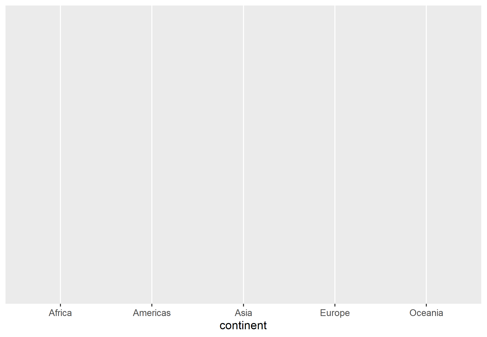

Det vi skriver i `aes()` kobler variabler til ting du ser i plottet. Det kan for eksempel være x- og y-verdier (`x = variabelnavn`, `y = variabelnavn`), farger (`color = variabelnavn`), former (`shape = variabelnavn`) eller størrelse (`size = variabelnavn`).


## Steg 3: Fortell ggplot hvordan du vil illustrere sammenhengen

Når vi kjører koden, så ser vi at kontinentene er på plass, men vi får likevel ikke noe særlig informasjon fra plottet. Hva mangler? Vi må skrive hva slags plott vi vil lage. Vi vil lage et stolpediagram, og velger `geom_bar()`. Hvis du prøver å skrive inn `geom_` vil du se at du får en hel rekke forslag til ulike plott. Flere av disse skal vi komme tilbake til.
 
```{r, eval = FALSE}
ggplot(data = data, aes(x=continent)) + 
  geom_bar()

```

```{r, include = FALSE}
ggplot(data = data, aes(x=continent)) + 
  geom_bar()

ggsave("../../output/sem3_steg3.png")
``` 

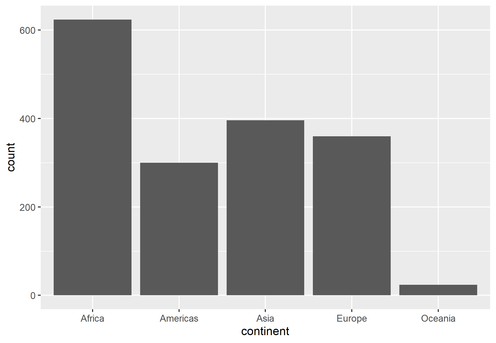

Da har vi fått opp et plott som viser observasjonene i datasettet fordelt på kontinenter. Vi kan dobbeltsjekke at dette ser riktig ut ved å lage et summary av variabelen. 

```{r}
summary(data$continent)
```

Det ser fint ut. Vi kan også legge inn andre typer av aestetics i mappingen. Her er det flere muligheter, som dere vil bli kjent med etter hvert. Én av dem er å bruke ulike farger for å gi informasjon. Hvis vi vil at hvert kontinent skal få sin egen farge, så kan vi gjøre det slik: 


```{r, eval = FALSE}
ggplot(data = data, aes(x = continent, fill = continent)) + 
  geom_bar()

```


```{r, include=FALSE}
ggplot(data = data, aes(x = continent, fill = continent)) + 
  geom_bar()

ggsave("../../output/sem3_steg3b.png")
```
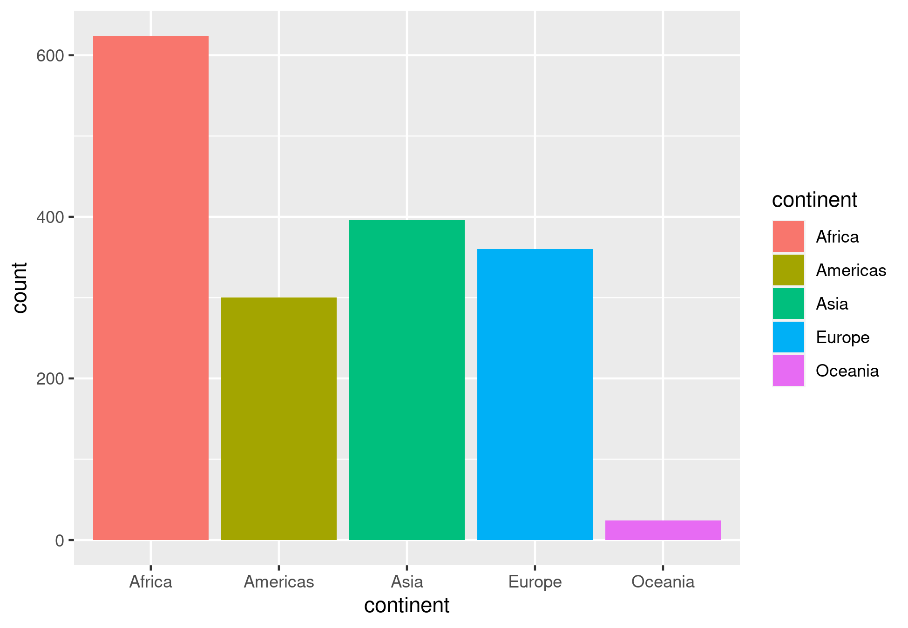

## Steg 4: Legg til `geom_` etter behov en etter en.
Vi kan legge til flere `geom_`-elementer i plottet vårt ved å bruke `+`. Jeg kan for eksempel legge til en linje som indikerer gjennomsnittlig antall observasjoner per land. Da legger vi først til en variabel som angir antall observasjoner per land i datasettet. Dette gjør vi ved hjelp av funksjonen `add_count()`:

```{r}
data <- data %>% 
  add_count(continent)
```

Vi kan se i datasettet vårt at vi har fått en ny variabel `n`. Denne angir antall observasjoner per kontinent i datasettet vårt. For å legge til en linje som indikerer gjenomsnittlig antall observasjoner bruker vi `geom_hline()` (h for horisontal linje). I `aes()` gir vi ggplot informasjon om hvor denne linjen skal krysse y-aksen: 

```{r, eval = FALSE}
ggplot(data = data, aes(x = continent, fill = continent)) + 
  geom_bar() +
  geom_hline(aes(yintercept = mean(n)))

```

```{r, include = FALSE}
ggplot(data = data, aes(x = continent, fill = continent)) + 
  geom_bar() +
  geom_hline(aes(yintercept = mean(n)))

ggsave("../../output/sem3_steg4.png")
```
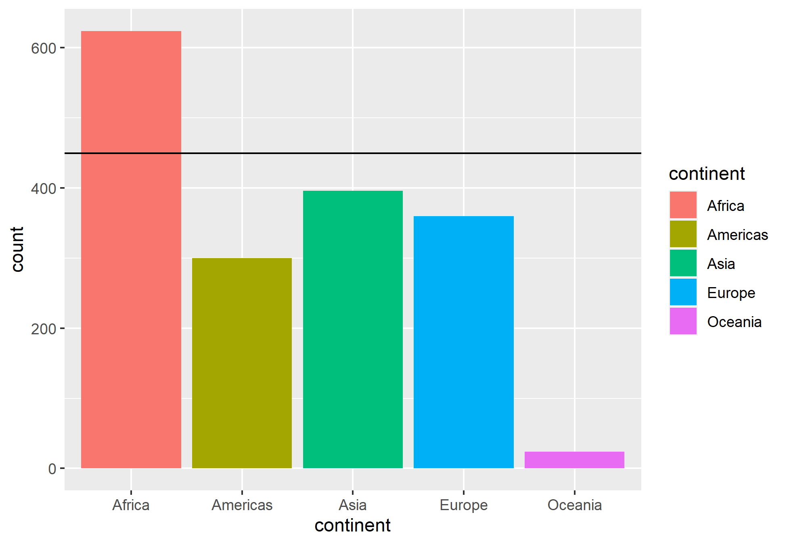 

## Steg 5: Bruk funksjoner til å justere skala, etiketter, tittel o.l..

Vi kan også endre teksten på x- og y-aksen, og gi plottet en tittel ved å legge til `labs()`, fjerne boksen med informasjon om farger og navn på høyre side ved hjelp av `theme(legend.position = "none")` og gjøre bakgrunnen litt penere med `theme_bw()`:

```{r, eval = FALSE}
ggplot(data, aes(x = continent, fill = continent)) + 
  geom_bar() +
  geom_hline(aes(yintercept = mean(n))) +
  labs(x = "", 
       y = "Antall land-år-observasjoner", 
       title = "Antall observasjoner per kontinent",
       caption = "Gjennomsnittlig antall observasjoner er gitt ved den horisontale linjen") +
  theme_bw() +
  theme(legend.position = "none") 

```

```{r, include = FALSE}
ggplot(data, aes(x = continent, fill = continent)) + 
  geom_bar() +
  geom_hline(aes(yintercept = mean(n))) +
  labs(x = "", 
       y = "Antall land-år-observasjoner", 
       title = "Antall observasjoner per kontinent",
       caption = "Gjennomsnittlig antall observasjoner er gitt ved den horisontale linjen") +
  theme_bw() +
  theme(legend.position = "none") 

ggsave("../../output/sem3_steg5.png")

```


Da har vi gått gjennom det helt grunnleggende i ggplot. Dette er en pakke med veldig mange ulike muligheter, og man blir bedre kjent med de for hver gang man bruker den. Jeg anbefaler dere å prøve dere fram, og sjekke ut noen av ressursene som jeg linker til i bunnen av dokumentet. Kjør gjerne deler av plottet for å se hva de ulike linjene gjør, google dere frem osv. 
 

# Ulike typer plott
Nå skal vi lage ulike typer av plott ved brukt av ggplot. Hva slags plott du vil lage vil avhenge av hva slags variabler det er du vil undersøke og målenivået på disse variablene. For eksempel er det ikke så nyttig å lage et stolpediagram hvor du har en kontinuerlig variabel på x-aksen (for eksempel forventet levealder, som er oppgitt i desimaltall). Da vil en stolpe for hver unike verdi gi veldig, veldig mange stolper. 

La oss i første omgang se på litt ulike varianter av plot for variabelen `lifeExp` som måler forventet levealder. Da lagrer vi først informasjon om data og verdier i et objekt så vi slipper å skrive det hver gang: 

```{r}
plot_le <- ggplot(data, aes(x = lifeExp))
```


## Histogrammer 

Når vi undersøker ulike plot kan vi skrive `plot_le +` i stedet for `ggplot(data, aes(lifeExp)) +` fordi sistnevne informasjon er lagret i førstnevnte objekt. Dette sparer oss for en del kode. For en kontinuerlig variabel så kan det være mer nyttig med et histogram, som lager stolper for intervaller: 

```{r, eval = FALSE}
plot_le +
  geom_histogram()

```

```{r, include = FALSE}
plot_le +
  geom_histogram()

ggsave("../../output/sem3_hist1.png")
```
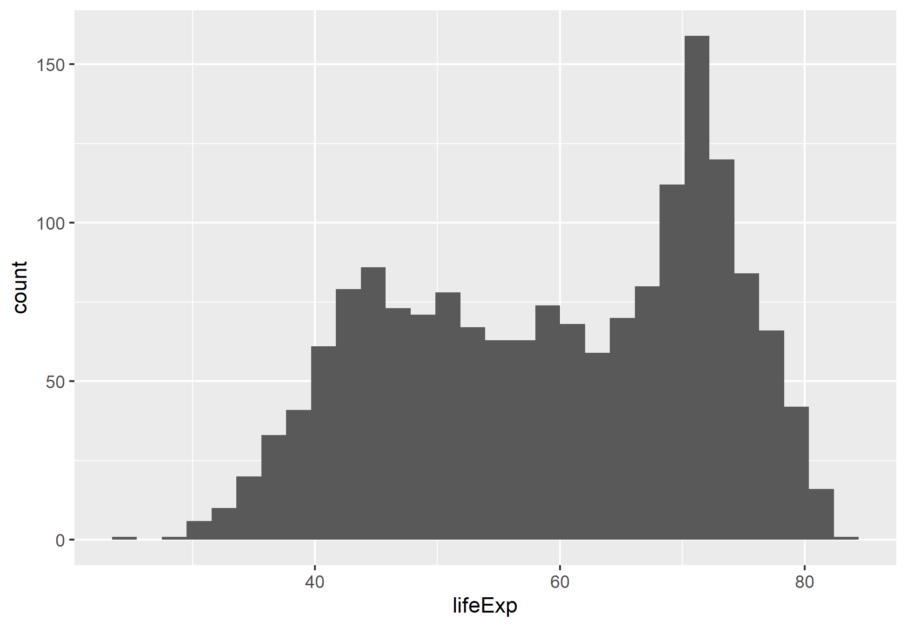

Hvis vi ikke sier noe annet, så kommer ggplot til å velge hvor stort hvert intervall skal være. Vi kan sette hver stolpe til å være ett år bred ved å skrive inn binwidth = 1: 

```{r, eval = FALSE}
plot_le +
  geom_histogram(binwidth = 1)

```

```{r, include = FALSE}
plot_le +
  geom_histogram(binwidth = 1)

ggsave("../../output/sem3_hist2.png")

```
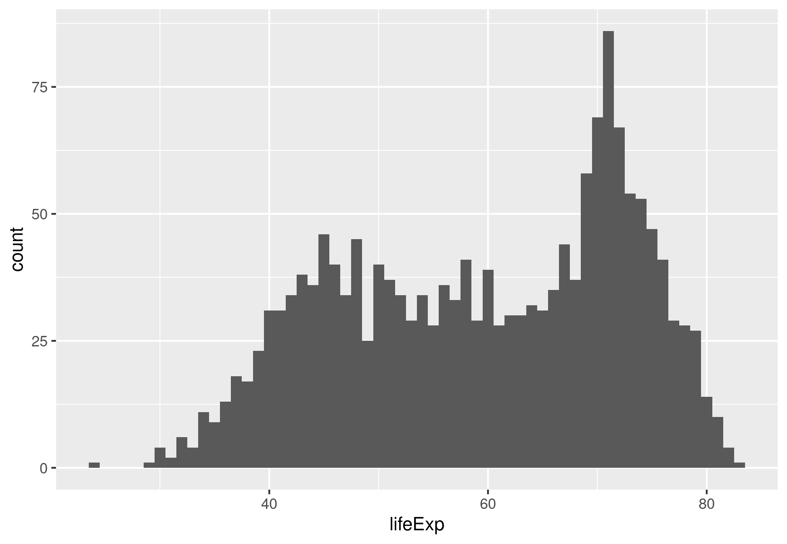

Hvis vi vil se hvordan dette fordeler seg på hvert kontinent, så kan vi legge inn fill: 

```{r, eval = FALSE}
plot_le +
  geom_histogram(aes(fill=continent),
                 binwidth = 1, 
                 alpha = 0.5) +
  theme_bw()

```

```{r, include = FALSE}
plot_le +
  geom_histogram(aes(fill=continent),
                 binwidth = 1, 
                 alpha = 0.5) +
  theme_bw()

ggsave("../../output/sem3_hist3.png")
```

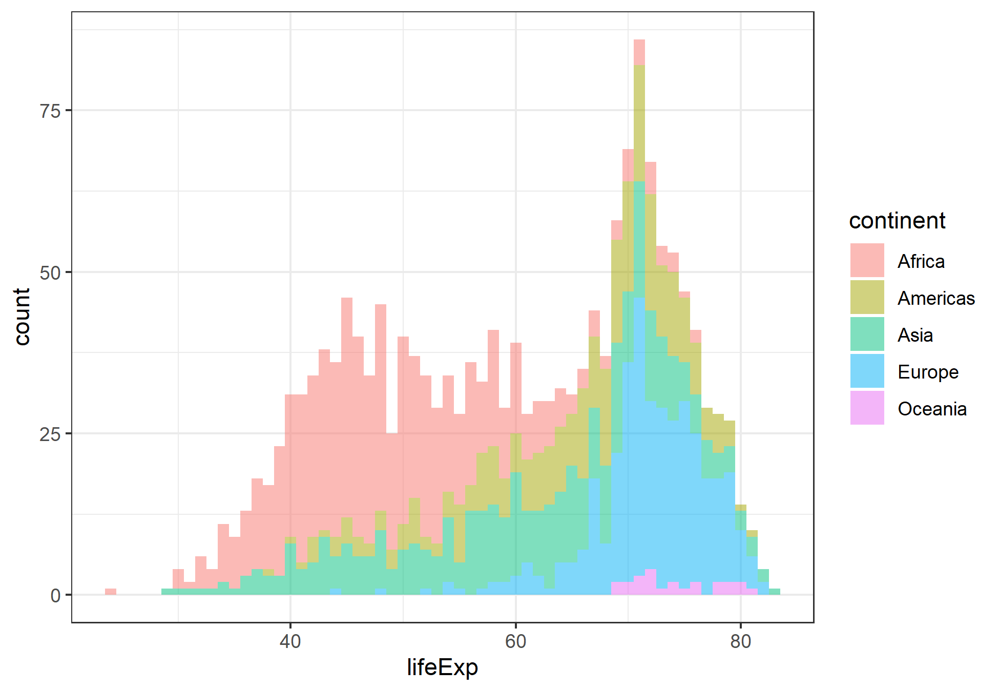


Dette gir oss en viss oversikt over hvordan forventet levealder varierer mellom kontinentene, men hvis vi vil se næremere på dette så kan et boxplot for forventet levealder per kontinent være et bedre alternativ. 


## Boxplot

for å lage et boxplot så spesifiserer vi y-aksen ved hjelp av `aes(y = continent)` i `geom_boxplot`:

```{r, eval = FALSE}
plot_le + 
  geom_boxplot(aes(y = continent))
```

```{r, include = FALSE}
plot_le + 
  geom_boxplot(aes(y = continent))

ggsave("../../output/sem3_box1.png")
```

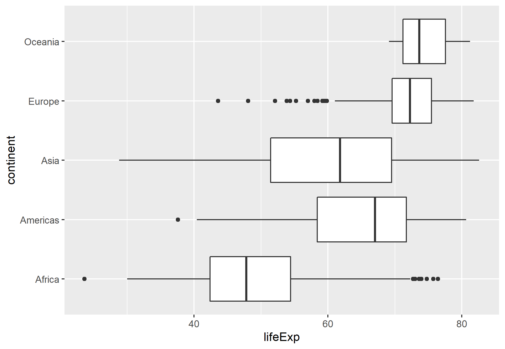

Her er et eksempel på hvor mye finere plottet kan bli med litt flere kodelinjer: 

```{r, eval = FALSE}
plot_le + 
  geom_boxplot(aes(y = continent)) +
  theme_bw() +
  labs(title = "Boxplot for forventet levealder per kontinent",
       x = "Forventet levealder",
       y = "") +
  theme(legend.position = "none")
```

```{r, include = FALSE}
plot_le + 
  geom_boxplot(aes(y = continent)) +
  theme_bw() +
  labs(title = "Boxplot for forventet levealder per kontinent",
       x = "Forventet levealder",
       y = "") +
  theme(legend.position = "none")

ggsave("../../output/sem3_box2.png")
```

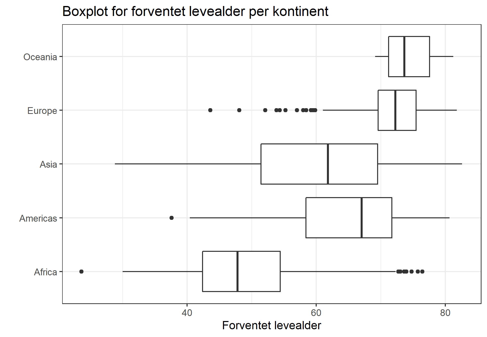
 
## Density plot/tettshetsplot
En annen metode kan være å bruke et density plot/tetthetsplott: 
 
```{r, eval = FALSE}
plot_le + 
  geom_density()
```

```{r, include = FALSE}
plot_le + 
  geom_density()

ggsave("../../output/sem3_dens1.png")
```

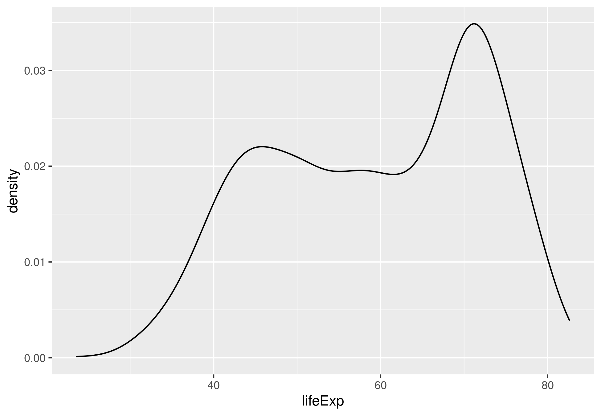

Inne i parentesen til plottypen kan vi legge til spesifikasjoner om tykkelse på linja, farge osv.

```{r, eval = FALSE}
plot_le + 
  geom_density(size=1.5, fill="pink", alpha=0.3)
```
```{r, include = FALSE}
plot_le + 
  geom_density(size=1.5, fill="pink", alpha=0.3)

ggsave("../../output/sem3_dens2.png")
``` 

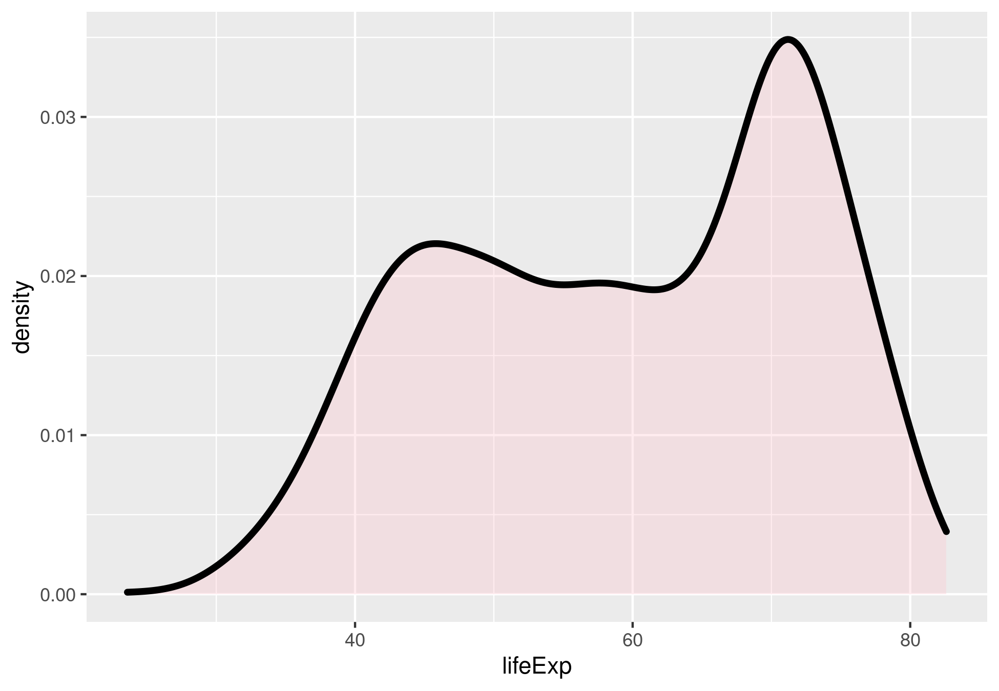 
 
Hva skjer hvis vi endrer 1) alpha til 1 og 2) size til 0.5?


```{r, eval = FALSE}
plot_le + 
  geom_density(size=0.5, fill="pink", alpha=1)
```
```{r, include = FALSE}
plot_le + 
  geom_density(size=0.5, fill="pink", alpha=1)

ggsave("../../output/sem3_dens3.png")

```

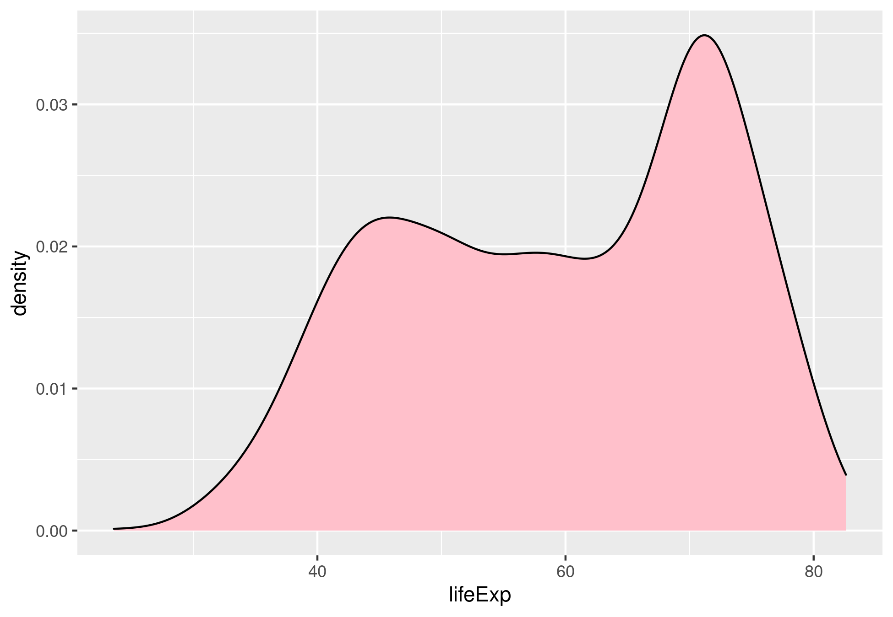

Hvis du ønsker å separere plottene, slik at de ulike kontinentene ikke ligger over hverandre, men får hvert sitt plott, så kan du legge til en facet_wrap: 

```{r, eval = FALSE}
plot_le + 
  geom_density(size=0.5, fill="pink", alpha=1) + 
  facet_wrap(vars(continent)) +
  theme_bw()

```

```{r, include = FALSE}
plot_le + 
  geom_density(size=0.5, fill="pink", alpha=1) + 
  facet_wrap(vars(continent)) +
  theme_bw()

ggsave("../../output/sem3_dens4.png")

```

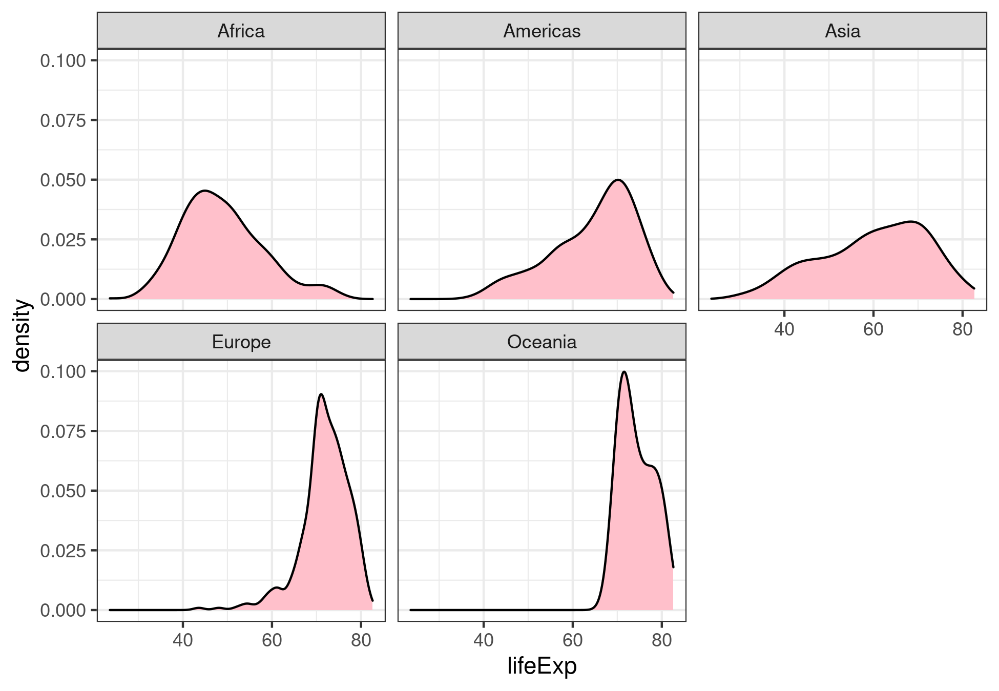

## Spredningsplot
Med et spredningsplot (scatterplot) kan vi vise sammenhengen mellom to kontinuerlige variabler. Her må vi gi ggplot informasjon om hvilken variabel som skal mappes på x-aksen og på y-aksen. For å lage scatterplottet bruker vi geom_point.  

```{r, eval = FALSE}
ggplot(data, 
       aes(x=lifeExp, y=gdpPercap)) + 
  geom_point()

```

```{r, include = FALSE}
ggplot(data, 
       aes(x=lifeExp, y=gdpPercap)) + 
  geom_point()

ggsave("../../output/sem3_scatt1.png")
``` 

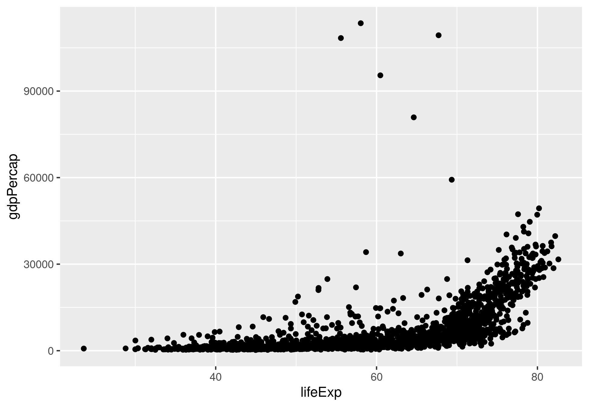

Vi kan legge til en linje som viser gjennomsnittet i observasjonene ved å bruke geom_smooth: 

```{r, eval = FALSE}
ggplot(data, aes(x=lifeExp, y=gdpPercap)) +
  geom_point() + 
  geom_smooth()

```
```{r, include = FALSE}
ggplot(data, aes(x=lifeExp, y=gdpPercap)) +
  geom_point() + 
  geom_smooth()

ggsave("../../output/sem3_scatt2.png")

```
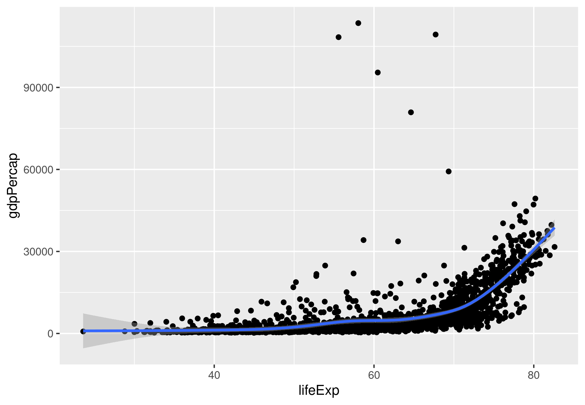
 
Skille kontinentene fra hverandre ved bruk av ulike farger: 

```{r, eval = FALSE}
ggplot(data, 
       aes(x=lifeExp, y=gdpPercap, col=continent)) +
  geom_point() + 
  geom_smooth()

```

```{r, include = FALSE}
ggplot(data, 
       aes(x=lifeExp, y=gdpPercap, col=continent)) +
  geom_point() + 
  geom_smooth()

ggsave("../../output/sem3_scatt3.png")

```
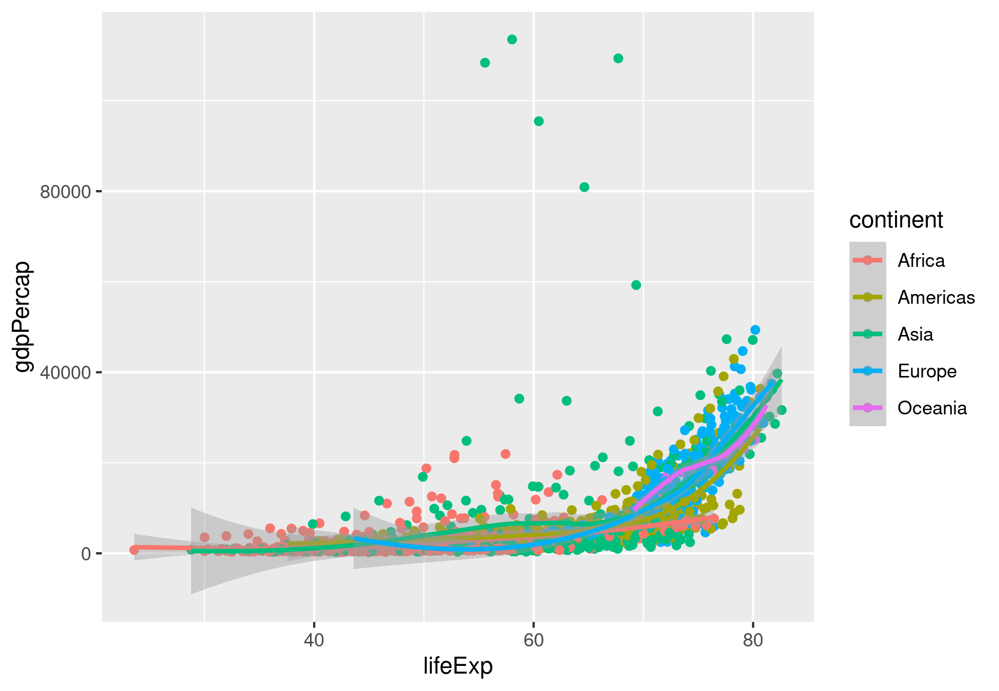

Vi kan legge inn en `facet_wrap()` for at det skal se litt ryddigere ut, og samtidig gi `geom_smooth()` en farge som vises bedre. 

```{r, eval = FALSE}
ggplot(data, 
       aes(x = lifeExp, y = gdpPercap, col = continent)) +
  geom_point() + 
  geom_smooth(colour="black") + 
  facet_wrap(~continent) +
  theme_bw() +
  theme(legend.position = "none")

```

```{r, include = FALSE}
ggplot(data, 
       aes(x = lifeExp, y = gdpPercap, col = continent)) +
  geom_point() + 
  geom_smooth(colour="black") + 
  facet_wrap(~continent) +
  theme_bw() +
  theme(legend.position = "none")

ggsave("../../output/sem3_scatt4.png")

```

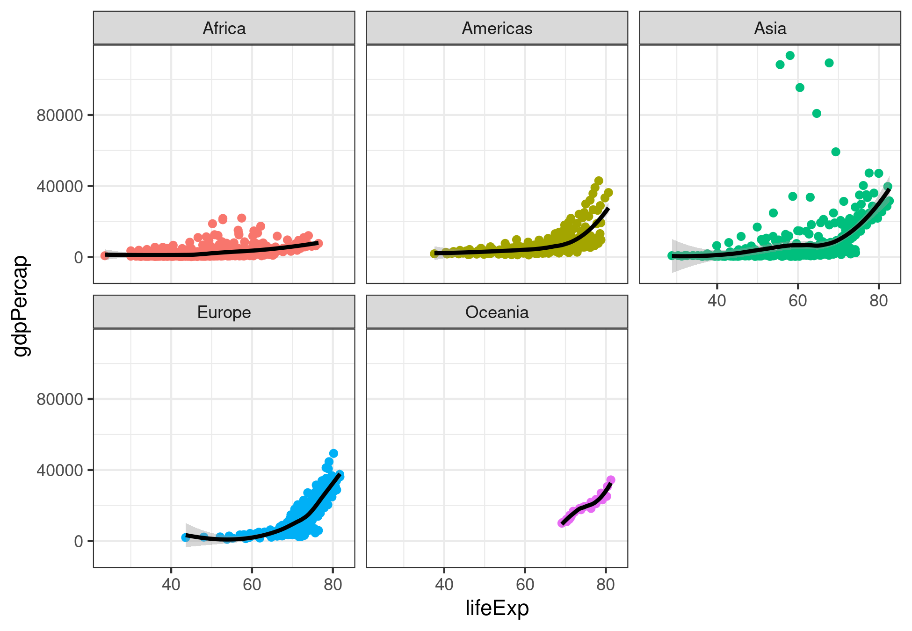

Her kan vi repetere hvordan vi legger til nye titler til x- og y-aksen, samt tittel for hele plottet: 

```{r, eval = FALSE}
ggplot(data, 
       aes(x = lifeExp, y = gdpPercap, col = continent)) +
  geom_point() + 
  geom_smooth(colour="black") + 
  facet_wrap(vars(continent)) +
  labs(x = "Forventet levealder", 
       y = "GDP per capita", 
       title = "Et plot med Gapminderdata") +
  theme_bw() +
  theme(legend.position = "none")

```

 
```{r, include = FALSE}
ggplot(data, 
       aes(x = lifeExp, y = gdpPercap, col = continent)) +
  geom_point() + 
  geom_smooth(colour="black") + 
  facet_wrap(vars(continent)) +
  labs(x = "Forventet levealder", 
       y = "GDP per capita", 
       title = "Et plot med Gapminderdata") +
  theme_bw() +
  theme(legend.position = "none")

ggsave("../../output/sem3_scatt5.png")
```
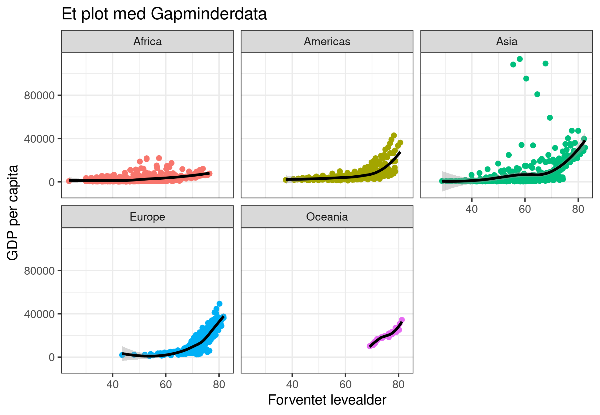

# Lagring av plott
Du kan lagre plottene dine i working directory ved å bruke `ggsave()`. For å lagre det siste plottet du har kjørt i R, gjør følgende: Bruk `ggsave()`, gi plottet et navn, og spesifiser filtypen du vil lagre som: 

```{r, eval = FALSE}
# For png-format:
ggsave(filename = "gdplevealder.png")
 
# For pdf-format:
ggsave(filename = "gdplevealder.pdf")

# For jpeg-format:
ggsave(filename = "gdplevealder.jpeg")

 
# Du trenger egentlig ikke skrive "filename" så lenge du bruker ggsave:
ggsave("gdplevealder.png")
```


For å lagre et plott som er et objekt gjør du følgende:
```{r, eval = FALSE}
ggsave(“navnpåplott.filtype”, plot = objektnavn)

# For eksempel:
ggsave("histogram_gapminder.png", plot = gm_h)

```


Ressurser for ggplot2: 

https://ggplot2.tidyverse.org/ 

https://socviz.co/makeplot.html#makeplot 

http://euclid.psych.yorku.ca/www/psy6135/tutorials/gapminder.html 
 
 