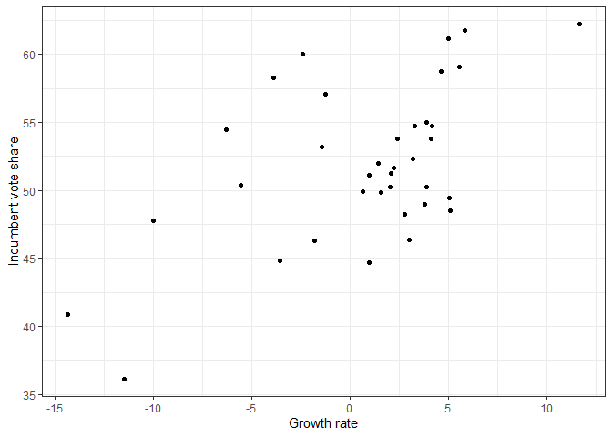
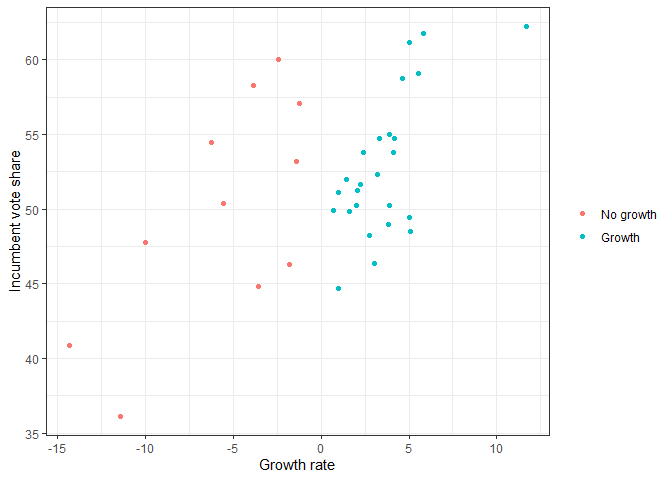
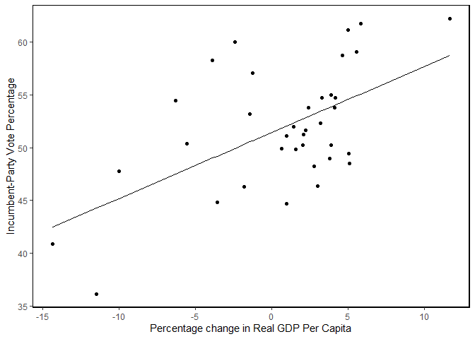

Seminar 5: univariat regresjon
================
Lise Rødland

I dag skal vi se på fem ting:

1.  Laste inn data (repetisjon)
2.  Omkoding av variabler (repetisjon)
3.  Plotting (repetisjon)
4.  Kjøre univariate regresjonsmodeller (nytt)
5.  Tolkning og fremstilling av regresjonsresultater (nytt)

Datasettet vi skal bruke er det samme som det som omtales i kapittel ni
i The Fundamentals of Political Science Research. I likhet med kapittel
ni så skal vi kjøre en univariat regresjon der vi ser på effekten av
økonomisk vekst (`growth`) på andel stemmer den sittende kandidaten får
(`inc_vote`). Det første vi skal gjøre er å sette working directory,
laste inn pakker og laste inn datasettet:

``` r
# Bestemmer working directory
setwd("../../STV1020/")

# Laster inn pakker
library(tidyverse)
library(stargazer)

# Laster inn datasettet
load("data/FairFPSR3.RData")
```

Vi bruker `load()` fordi datasettet er i .Rdata-format.

## Undersøker data

Når vi skal kjøre en regresjonsanalyse så er noe av det første vi gjør
er å undersøke datasettet:

``` r
# Hent ut informasjon om variabelnavn, klasse m.m.
str(FairFPSR3)
```

    ## tibble [36 x 5] (S3: tbl_df/tbl/data.frame)
    ##  $ inc_vote : num [1:36] 48.5 50.2 49.8 50.4 48.3 ...
    ##   ..- attr(*, "format.stata")= chr "%9.0g"
    ##  $ year     : num [1:36] 1876 1880 1884 1888 1892 ...
    ##   ..- attr(*, "format.stata")= chr "%9.0g"
    ##  $ inflation: num [1:36] NA 1.974 1.055 0.604 2.274 ...
    ##   ..- attr(*, "format.stata")= chr "%9.0g"
    ##  $ goodnews : num [1:36] NA 9 2 3 7 6 7 5 8 8 ...
    ##   ..- attr(*, "format.stata")= chr "%9.0g"
    ##  $ growth   : num [1:36] 5.11 3.88 1.59 -5.55 2.76 ...
    ##   ..- attr(*, "format.stata")= chr "%9.0g"

``` r
# Et alternativ til str()
FairFPSR3
```

    ## # A tibble: 36 x 5
    ##    inc_vote  year inflation goodnews growth
    ##       <dbl> <dbl>     <dbl>    <dbl>  <dbl>
    ##  1     48.5  1876    NA           NA   5.11
    ##  2     50.2  1880     1.97         9   3.88
    ##  3     49.8  1884     1.05         2   1.59
    ##  4     50.4  1888     0.604        3  -5.55
    ##  5     48.3  1892     2.27         7   2.76
    ##  6     47.8  1896     3.41         6 -10.0 
    ##  7     53.2  1900     2.55         7  -1.42
    ##  8     60.0  1904     1.44         5  -2.42
    ##  9     54.5  1908     1.88         8  -6.28
    ## 10     54.7  1912     2.17         8   4.16
    ## # ... with 26 more rows

``` r
# Printer variabelnavnene
names(FairFPSR3)
```

    ## [1] "inc_vote"  "year"      "inflation" "goodnews"  "growth"

Det er også lurt å sjekke om mange observasjoner har manglende
informasjon på noen av variablene du er interessert i.

``` r
# Sjekker hvor mange observasjoner som har manglende informasjon/missing/NA
table(complete.cases(FairFPSR3))
```

    ## 
    ## FALSE  TRUE 
    ##     1    35

``` r
# Sjekker hvor mange observasjoner som har missing på variabelen inflation
table(is.na(FairFPSR3$inflation))
```

    ## 
    ## FALSE  TRUE 
    ##    35     1

Legg merke til at funksjonene `complete.cases()` og `is.na()` er logiske
tester. Disse evaluerer hver observasjon og sjekker om de har missing på
noen variabler (`complete.cases()`) eller på variabelen `inflation`. For
å illustrere dette så kan vi prøve å legge til to nye variabler i
datasettet basert på disse logiske testene:

``` r
FairFPSR3 <- FairFPSR3 %>% 
  mutate(complete = complete.cases(.),
         inf_na = is.na(inflation))
```

Bruk `view()` eller klikk på datasettet ditt for å se hvordan de nye
variablene ser ut. Hva betyr `TRUE` og `FALSE` i de to kolonnene?

**SETT INN MER OM PLOTTING HER** (inkl. hvordan lagre plot)

``` r
ggplot(data = FairFPSR3) +
  geom_point(aes(y = inc_vote, x=growth))+
  theme_bw() +
  theme(legend.title=element_blank()) +
  ylab("Incumbent vote share") +
  xlab("Growth rate")
```

<!-- -->

## Omkoding av variabler

Etter at vi har kartlagt datastrukturen og hvilke variabler vi har så må
vi vurdere om noen av variablene må omkodes før vi kan gjøre analysen
vår. For å få samme resultater som i kapittel ni trenger vi ikke å
omkode noe, men for å få noe å sammenligne med skal vi lage en dikotom
variabel. I `tidyverse` bruker man som regel `mutate()`sammen med andre
funksjoner for å opprette nye variabler. Koden over hvor vi opprettet
variabler for de logiske testene `complete.cases()` og `is.na()` er
eksempler på dette. Nå skal vi også kombinere `mutate()` med `if.else`
for å lage en dikotom variabel som tar verdien `Growth` om observasjonen
er et år med positiv økonomisk vekst og `No growth` om observasjonen er
et år uten økonomisk vekst:

``` r
# Oppretter den nye variabelen og endrer referansekategori
FairFPSR3 <- FairFPSR3 %>% 
  mutate(growth_dich = ifelse(growth > 0, "Growth", "No growth"),
         growth_dich = factor(growth_dich, levels = c("No growth", "Growth")))

# Sjekker at det ser ok ut: 
class(FairFPSR3$growth_dich)
```

    ## [1] "factor"

``` r
table(FairFPSR3$growth_dich, useNA = "always")
```

    ## 
    ## No growth    Growth      <NA> 
    ##        11        25         0

Når du lager en faktor-variabel så setter tar R utgangspunkt i alfabetet
når referansekategorien bestemmes. I dette tilfellet ville
referansekateogrien blitt “Growth”, men vi bruker `factor()` til å endre
referansekategorien til “No growth”. Når en omkoder numeriske variabler
så kan det være nyttig å lage et plott for å sjekke at det ble riktig.
Her bruker vi `color` argumentet til å gi ulik farge til observasjonene
vi plottet tidligere.

``` r
ggplot(data = FairFPSR3) +
  geom_point(aes(x=growth, y = inc_vote, col = growth_dich)) +
  theme_bw() +
  theme(legend.title=element_blank()) +
  ylab("Incumbent vote share") +
  xlab("Growth rate") 
```

<!-- -->

## Univariat regresjon med numerisk uavhengig variabel

For å kjøre en univariat lineær regresjon i R så bruker vi funksjonen
`lm()`. `lm()` har følgende syntaks:

``` r
lm(avhengig_variabel ~ uavhengig_variabel, data = mitt_datasett)
# På mac får du ~ med alt + k + space
```

Dersom datasettet ditt har manglende informasjon (missing/NA) så må du
legge til et element som sier hvordan regresjonen skal forholde seg til
dette. Ved å legge til `na.action = "na.exclude" i`lm()`så beholder R
informasjon om hvilke observasjoner som mangler data slik at vi kan
bruke`fitted()\` som vi skal snakke mer om senere.

I eksempelet fra kapittel ni i Kellsted og Whitten er vi interessert i
effekten av den uavengige variabelen `growth` på den avhengige
variabelen `inc_vote`. Under kjører vi modellen og lagrer den som
`model` i Environment:

``` r
model <- lm(inc_vote ~ growth, 
            data = FairFPSR3,
            na.action = "na.exclude")
```

Det finnes flere måter å undersøke resultatene på. Vi skal se på hvordan
vi kan gjøre dette ved hjelp av `summary()`, `stargazer()` og
`ggplot()`. Vi skal først se på `summary()`.

``` r
summary(model)
```

    ## 
    ## Call:
    ## lm(formula = inc_vote ~ growth, data = FairFPSR3, na.action = "na.exclude")
    ## 
    ## Residuals:
    ##     Min      1Q  Median      3Q     Max 
    ## -8.1384 -3.7445 -0.6354  2.8291 10.0700 
    ## 
    ## Coefficients:
    ##             Estimate Std. Error t value Pr(>|t|)    
    ## (Intercept)  51.4486     0.8133  63.256  < 2e-16 ***
    ## growth        0.6248     0.1550   4.032 0.000295 ***
    ## ---
    ## Signif. codes:  0 '***' 0.001 '**' 0.01 '*' 0.05 '.' 0.1 ' ' 1
    ## 
    ## Residual standard error: 4.828 on 34 degrees of freedom
    ## Multiple R-squared:  0.3235, Adjusted R-squared:  0.3036 
    ## F-statistic: 16.26 on 1 and 34 DF,  p-value: 0.0002955

`stargazer()` er en nyttig funksjon som gir oss samme informasjon som
`summary()`, men i et litt mer lettlest format.

``` r
stargazer(model, 
          type = "text")
```

    ## 
    ## ===============================================
    ##                         Dependent variable:    
    ##                     ---------------------------
    ##                              inc_vote          
    ## -----------------------------------------------
    ## growth                       0.625***          
    ##                               (0.155)          
    ##                                                
    ## Constant                     51.449***         
    ##                               (0.813)          
    ##                                                
    ## -----------------------------------------------
    ## Observations                    36             
    ## R2                             0.323           
    ## Adjusted R2                    0.304           
    ## Residual Std. Error       4.828 (df = 34)      
    ## F Statistic           16.256*** (df = 1; 34)   
    ## ===============================================
    ## Note:               *p<0.1; **p<0.05; ***p<0.01

Ved hjelp av stargazer så kan vi også lagre tabeller lokalt på PC-en som
vi kan bruke i word-dokumenter og liknende. Da endrer vi på `type`
argumentet og legger til et `out` argument. `out` argumentet forteller i
hvilken mappe du vil lagre filen samt hva filen skal hete. Da får du en
.htm-fil som ser omtrent ut som i eksempelet under. Den kan du
høyreklikke på og velge åpne i word dersom du skal ha tabellen inn i en
oppgave eller liknende.

``` r
stargazer(model,  
          type = "html",
          out = "output/model1_tab.htm")
```

<!--html_preserve-->

<table style="text-align:center">

<tr>

<td colspan="2" style="border-bottom: 1px solid black">

</td>

</tr>

<tr>

<td style="text-align:left">

</td>

<td>

<em>Dependent variable:</em>

</td>

</tr>

<tr>

<td>

</td>

<td colspan="1" style="border-bottom: 1px solid black">

</td>

</tr>

<tr>

<td style="text-align:left">

</td>

<td>

inc\_vote

</td>

</tr>

<tr>

<td colspan="2" style="border-bottom: 1px solid black">

</td>

</tr>

<tr>

<td style="text-align:left">

growth

</td>

<td>

0.625<sup>\*\*\*</sup>

</td>

</tr>

<tr>

<td style="text-align:left">

</td>

<td>

(0.155)

</td>

</tr>

<tr>

<td style="text-align:left">

</td>

<td>

</td>

</tr>

<tr>

<td style="text-align:left">

Constant

</td>

<td>

51.449<sup>\*\*\*</sup>

</td>

</tr>

<tr>

<td style="text-align:left">

</td>

<td>

(0.813)

</td>

</tr>

<tr>

<td style="text-align:left">

</td>

<td>

</td>

</tr>

<tr>

<td colspan="2" style="border-bottom: 1px solid black">

</td>

</tr>

<tr>

<td style="text-align:left">

Observations

</td>

<td>

36

</td>

</tr>

<tr>

<td style="text-align:left">

R<sup>2</sup>

</td>

<td>

0.323

</td>

</tr>

<tr>

<td style="text-align:left">

Adjusted R<sup>2</sup>

</td>

<td>

0.304

</td>

</tr>

<tr>

<td style="text-align:left">

Residual Std. Error

</td>

<td>

4.828 (df = 34)

</td>

</tr>

<tr>

<td style="text-align:left">

F Statistic

</td>

<td>

16.256<sup>\*\*\*</sup> (df = 1; 34)

</td>

</tr>

<tr>

<td colspan="2" style="border-bottom: 1px solid black">

</td>

</tr>

<tr>

<td style="text-align:left">

<em>Note:</em>

</td>

<td style="text-align:right">

<sup>*</sup>p\<0.1; <sup>**</sup>p\<0.05; <sup>***</sup>p\<0.01

</td>

</tr>

</table>

<!--/html_preserve-->

Informasjonen vi får ved hjelp av `summary()` og `stargazer()` er veldig
nyttig. Vi får vite koeffisientene, standardfeilene og informasjon vi
kan bruke til å evaluere modellen vår. I seminar skal vi bruke en del
tid på å tolke disse tabellene.

Et alternativ til tabeller er å plotte resultatene fra regresjonen. Nå
skal vi lage figur 9.4 i kapittel ni ved hjelp av `ggplot()`.

Først lager vi et plott med de observerte verdiene:

``` r
ggplot(data = FairFPSR3) +
  geom_point(aes(x = growth, y = inc_vote)) +
  theme_classic() +
  theme(axis.line = element_line(colour = "black"),
        panel.border = element_rect(colour = "black", fill=NA, size=1)) +
  ylab("Incumbent-Party Vote Percentage") +
  xlab("Percentage change in Real GDP Per Capita") 
```

<!-- -->

Det neste vi skal gjøre er å legge til regresjonslinjen i plottet. For å
gjøre det skal vi først løse regresjonslikningen for alle observasjonene
våre. Årsaken er at vi nå vil legge til verdiene på den avhengige
variabelen stemmeandeler som modellen vår gir oss og ikke de observerte
verdiene. R kan gjøre utregningen for oss ved hjelp av funksjonen
´fitted()´ så vi slipper heldigvis å gjøre det for hånd.

``` r
FairFPSR3 <- FairFPSR3 %>% 
  mutate(fitted = fitted(model), 
         residuals = resid(model))
```

Nå kan vi bruke denne informasjonen til å legge til en regresjonslinje i
plottet vårt. Prikkene angir de ulike *observerte* verdikominasjonene,
mens den rette linjen gir oss den lineære sammenhengen fra modellen vår.

``` r
ggplot(data = FairFPSR3) +
  geom_point(aes(x = growth, y = inc_vote)) +
  theme_classic() +
  theme(axis.line = element_line(colour = "black"),
        panel.border = element_rect(colour = "black", fill=NA, size=1)) +
  ylab("Incumbent-Party Vote Percentage") +
  xlab("Percentage change in Real GDP Per Capita") +
  geom_line(aes(x = growth, y = fitted))
```

<!-- -->

I kapittel ni viser Kellstedt og Whitten at regresjonslinjen krysser
utvalgets gjennomsnittsverdier på uavhengig og avhengig variabel. Det
kan vi også vise ved å legge til to linjer i koden vår:

``` r
ggplot(data = FairFPSR3) +
  geom_point(aes(x = growth, y = inc_vote)) +
  theme_classic() +
  theme(axis.line = element_line(colour = "black"),
        panel.border = element_rect(colour = "black", fill=NA, size=1)) +
  ylab("Incumbent-Party Vote Percentage") +
  xlab("Percentage change in Real GDP Per Capita") +
  geom_line(aes(x = growth, y = fitted)) +
  geom_hline(yintercept=mean(FairFPSR3$inc_vote), linetype = "dashed") +
  geom_vline(xintercept=mean(FairFPSR3$growth), linetype = "dashed")
```

<!-- -->

I kapittel ni er det flere eksempler på hvordan vi kan sjekke om en
modell er god eller ikke. Noe av det gikk vi gjennom når vi så på
resultatene av modellen. En ting som ikke kommer med når vi bruker
`stargazer()` og `summary()` er konfidensintervallene til en
koeffisient. De kan vi enkelt hente ut ved hjelp av funksjonen
`confint()`

``` r
confint(model)
```

    ##                  2.5 %     97.5 %
    ## (Intercept) 49.7957308 53.1015677
    ## growth       0.3098843  0.9397437

## Univariat regresjon med dikotom uavhengig variabel

For å øve oss på tolkning skal vi nå kjøre en modell med `inc_vote` som
avhengig variabel og den dikotome vekst-variabelen vi lagde tidligere
som forklaringsvariabel. Hvilken verdi representerer konstantleddet i
denne regresjonen?

``` r
model_dich <- lm(inc_vote ~ growth_dich, data = FairFPSR3)
stargazer(model_dich, 
          type = "text")
```

    ## 
    ## ===============================================
    ##                         Dependent variable:    
    ##                     ---------------------------
    ##                              inc_vote          
    ## -----------------------------------------------
    ## growth_dichGrowth              2.859           
    ##                               (2.066)          
    ##                                                
    ## Constant                     49.940***         
    ##                               (1.722)          
    ##                                                
    ## -----------------------------------------------
    ## Observations                    36             
    ## R2                             0.053           
    ## Adjusted R2                    0.025           
    ## Residual Std. Error       5.711 (df = 34)      
    ## F Statistic             1.914 (df = 1; 34)     
    ## ===============================================
    ## Note:               *p<0.1; **p<0.05; ***p<0.01

## Oppgaver

1.  Last inn datasettet ess\_no.  
2.  Finn navn på variablene.
3.  Google noe\!
4.  Plot
5.  Kjør en regresjonsmodell med hvor lykkelig en person er (happy) som
    avhengig variabel og i hvilken grad en opplever å ha innflytelse på
    det myndighetene gjør (influence) som uavhengig variabel.
6.  Tolk koeffisienten til influence.
7.  Print resultatet av regresjonen i en tabell ved hjelp av
    `stargazer()`. Lagre tabellen lokalt på pc-en din og åpne den i
    f.eks. word eller en nettleser.
8.  Lag et plott med de predikerte y-verdiene på y-aksen og verdiene av
    x på x-aksen. Lagre plottet lokalt på pc-en din.
