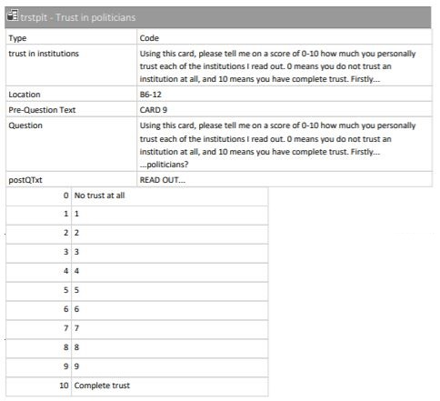

# Oppgaver til seminar 2 

1. Les inn datasettet ESS9NO.dta med alle variablene igjen. 
2. Variabelen `trstplt` måler tillit til politikere og variabelen `gndr` inneholder informasjon om respondentens kjønn. Gi disse to variablene samt `yrbrn` nye navn. Du skal bruke dine egne navn på variablene i de neste oppgavene der det står `trstplt`, `gndr` og `yrbrn`. 
3. Bruk `yrbrn` til å lage en ny variabel med informasjon om respondentens alder. 
4. Lag et datasett som bare inneholder `trstplt`, `gndr`, `yrbrn`, `vote` og den nye aldersvariabelen.
5. Hvilken klasse har `trstplt` og `gndr`? (Bonusspørsmål: hvilket målenivå har de?)
6. Hvor mange verdier har `trstplt`? Hvor mange har svart at de har "Complete trust" til politikere? 
7. Lag et barplot/søylediagram som viser fordelingen til `trstplt`. Si noe kort om hvordan verdiene fordeler seg. 
8. Er det forskjell mellom hvor mange kvinner og menn som stemte? Vis dette ved hjelp av en graf. 
9. Er det en forskjell i spredningen av alder for de som stemte og de som ikke stemte? Vis dette ved hjelp av en graf. Hint: her kan det være lurt å kombinere et av plottene vi har sett på for kontinuerlige variabler med `fill = vote`.  

